When I co-founded Imux, our mission was crystal clear: we wanted to help managers and executives easily query their company databases using simple, clear English. This idea grew from a common problem in many organizations: the heavy reliance on complicated SQL queries, which often required data analysts for support. Throughout this journey, I learned an important lesson: technology should make our jobs easier, not create more obstacles.

In my role as product and design lead, I threw myself into the creative process. We brainstormed numerous ideas and conducted in-depth qualitative research to pinpoint our target users’ needs. After thoroughly analyzing the competitive landscape, it became evident that there was a significant gap in the market for user-friendly data querying tools. Traditional data visualization products often prioritized complex insights over usability for everyday users. This gap presented us with a unique opportunity.

Our startup journey took an exciting turn when we were selected as part of a delegation to South Korea through our accelerator, Zeroth AI. This experience was crucial for our team, allowing us to connect with industry leaders and gain invaluable insights that shaped our approach. Ultimately, this enriched networking led us to secure seed funding, a vital boost for pushing our product forward.

Managing customer onboarding was another rewarding aspect of our journey as we initially acquired clients from India's InsurTech sector and the Ecommerce industries in Vietnam and South Korea. Engaging with these customers provided me with direct insight into their needs and how we could enhance our product. This firsthand experience taught me just how vital it is to understand user expectations in SaaS product development.

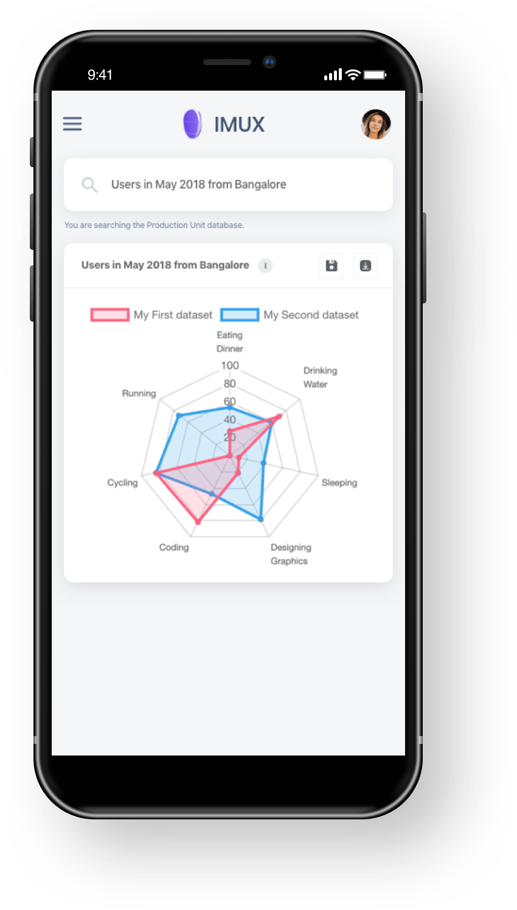

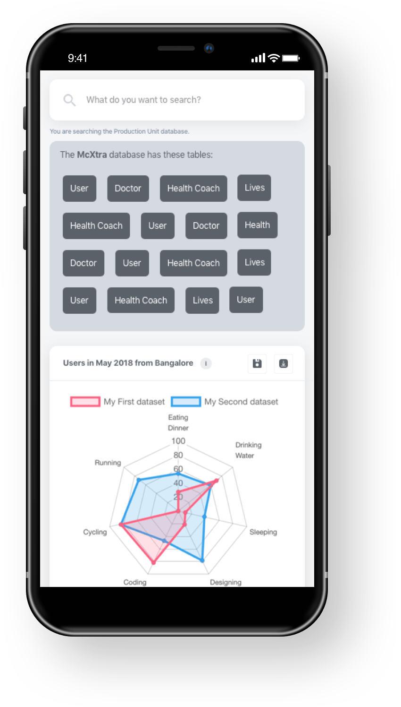

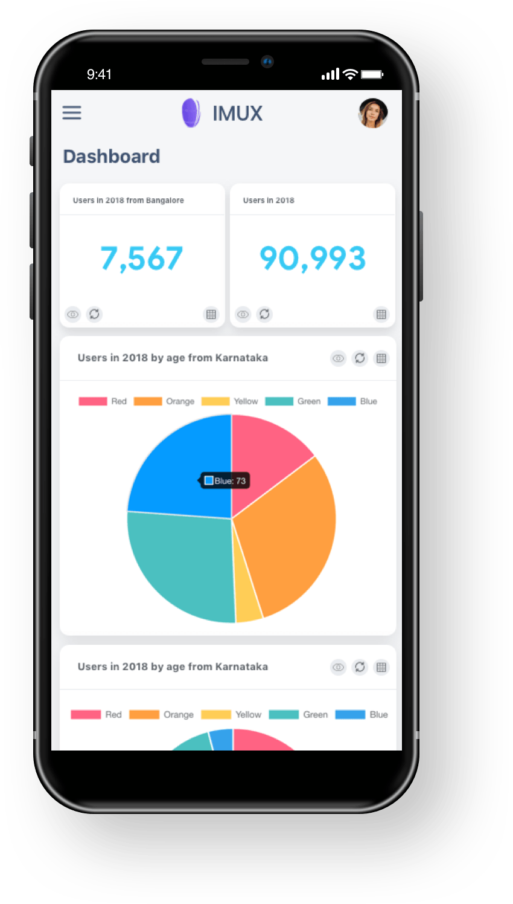

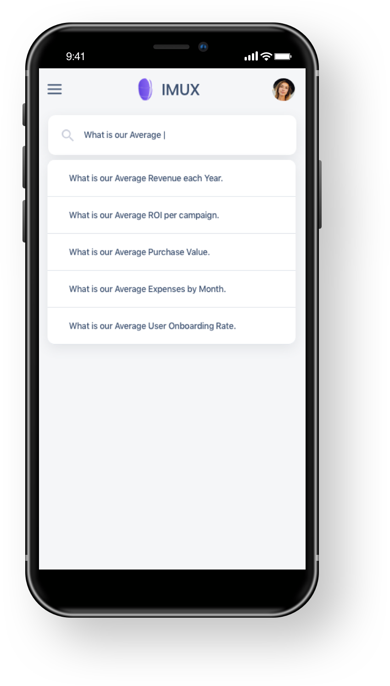

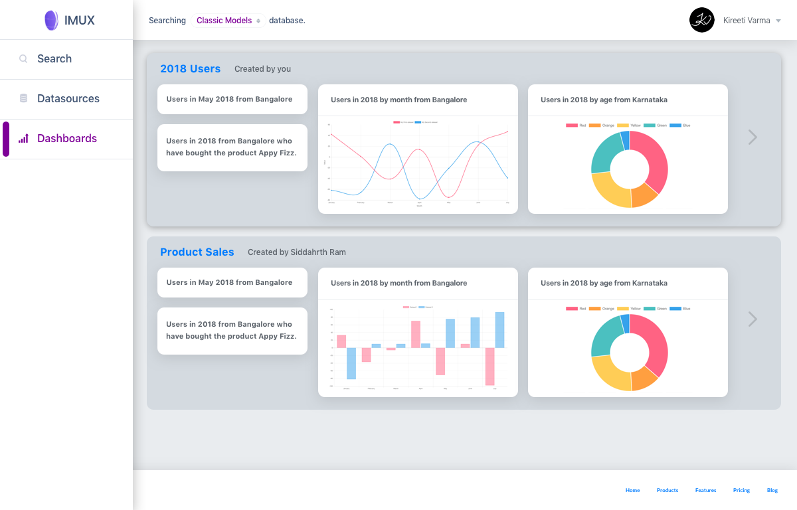

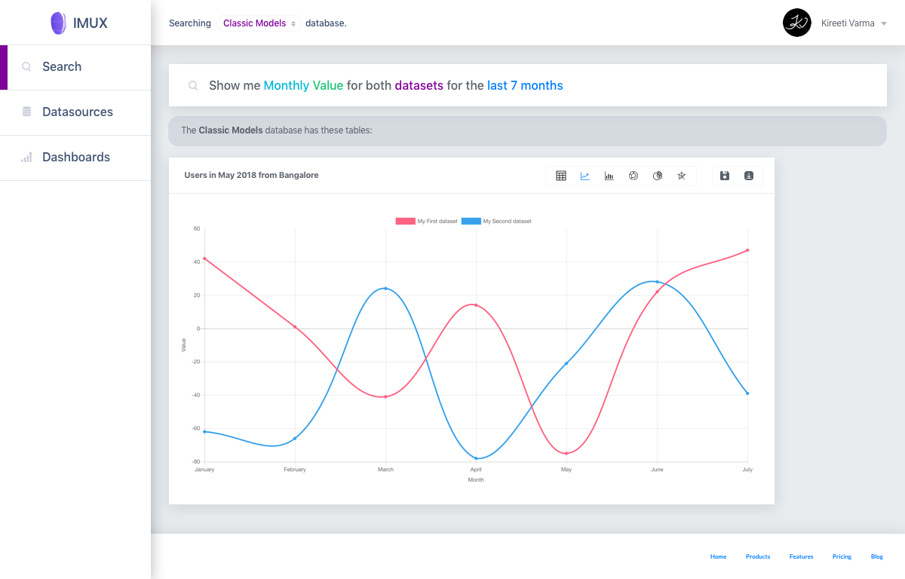

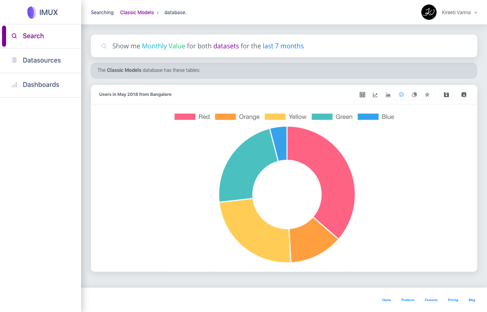

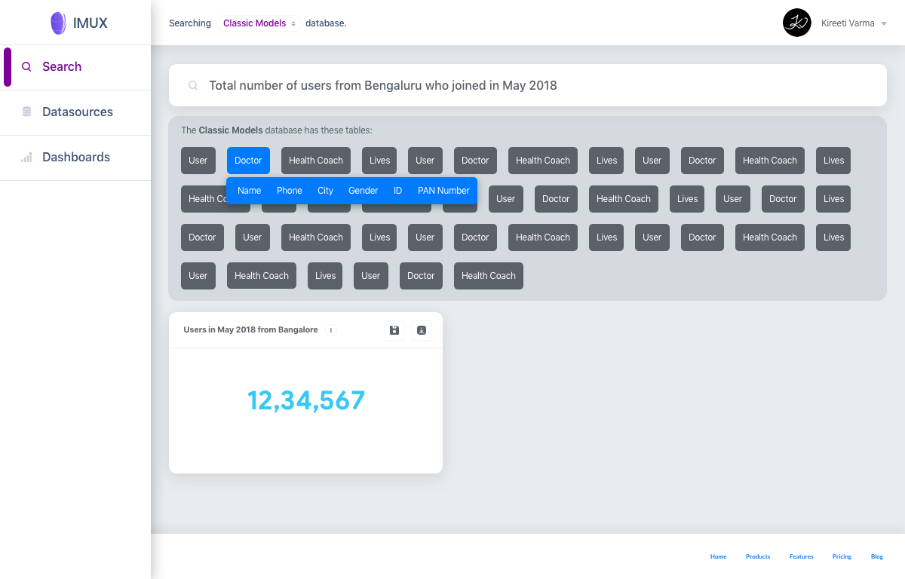

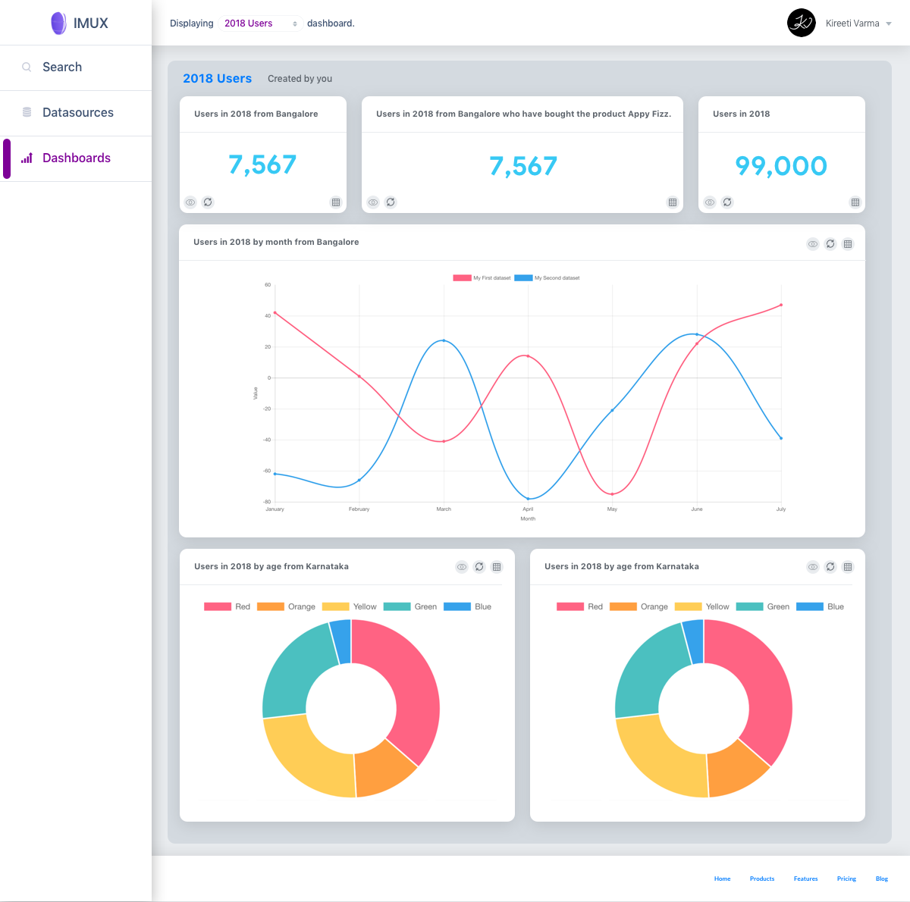

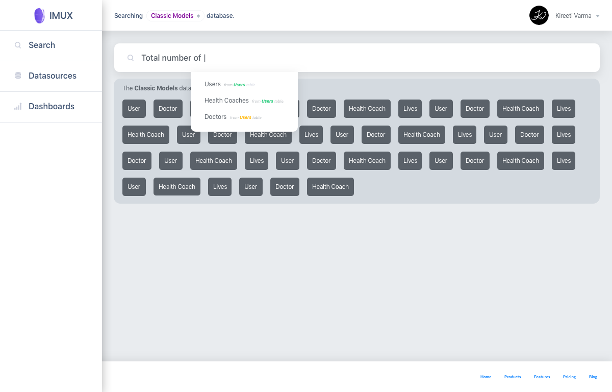

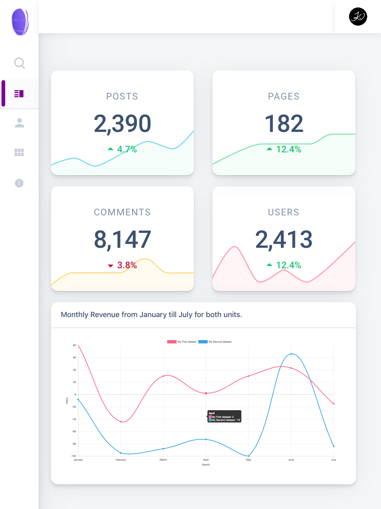

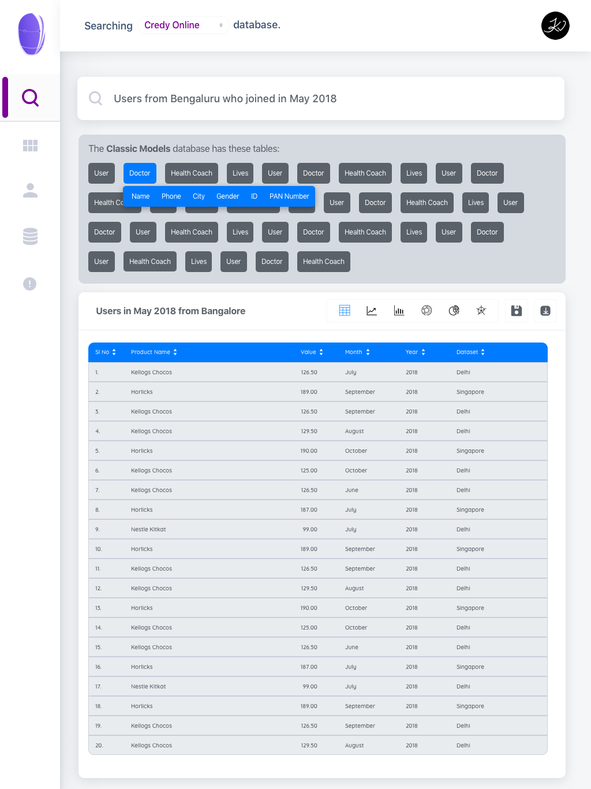

User experience is often tied to aesthetics; if a platform is attractive and easy to navigate, users are more likely to engage. We aimed for a balance between functionality and visual appeal, knowing that 93% of consumers make their purchase decisions based on visual appearance alone.

Launching our NLiDB SaaS Product Imux was not merely about developing a product; it was about creating a solution. Our goal was to bridge the gap between complex data and everyday users. Watching our vision become reality has been deeply fulfilling. The positive feedback from our users, as they navigated their databases with ease, provided the motivation we needed to keep improving and innovating.
