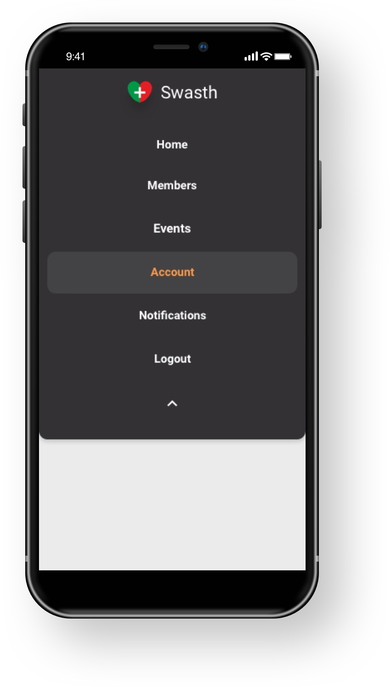
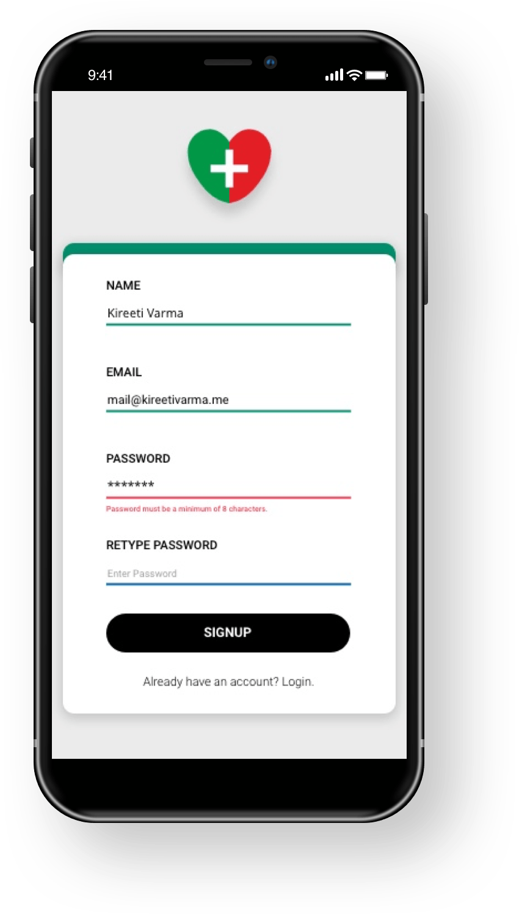
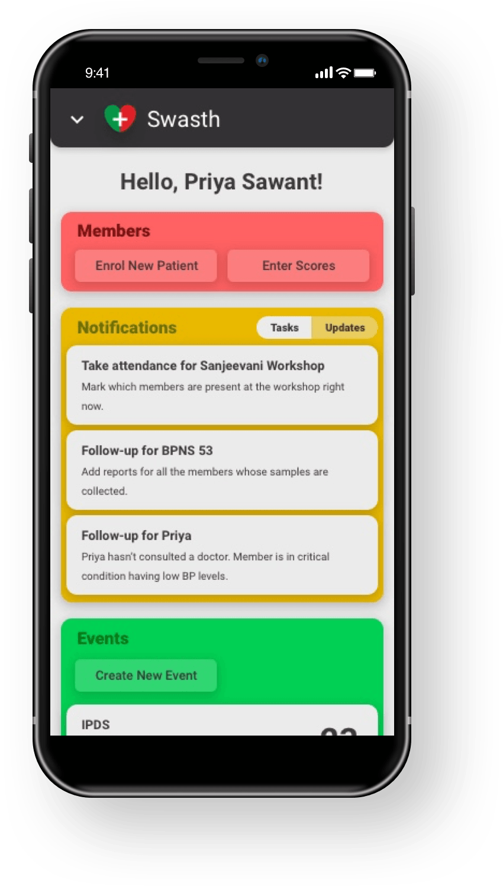
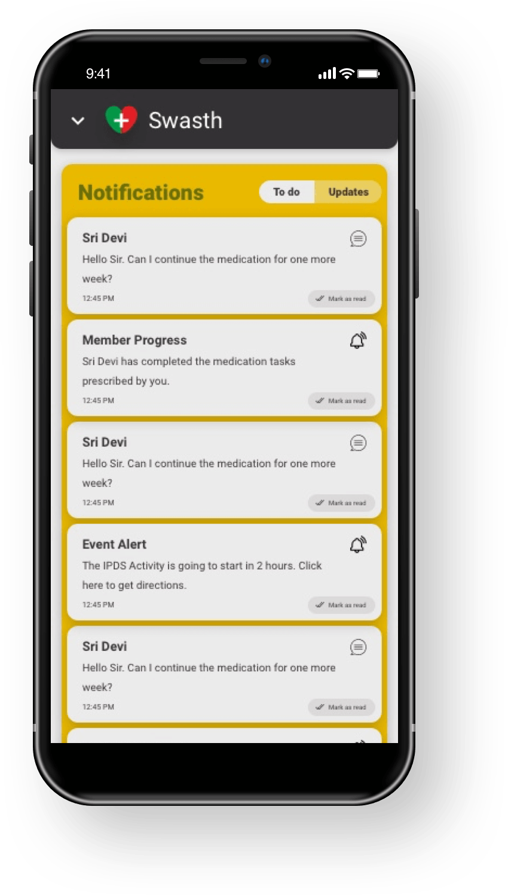
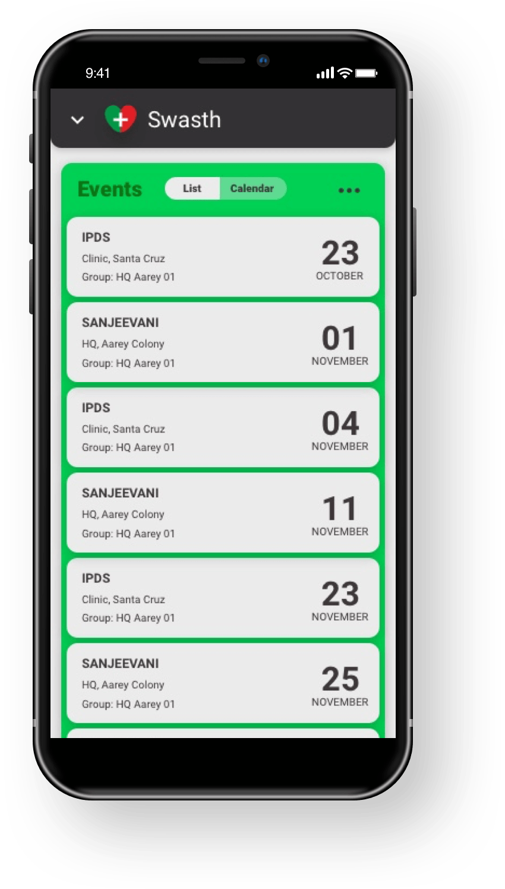
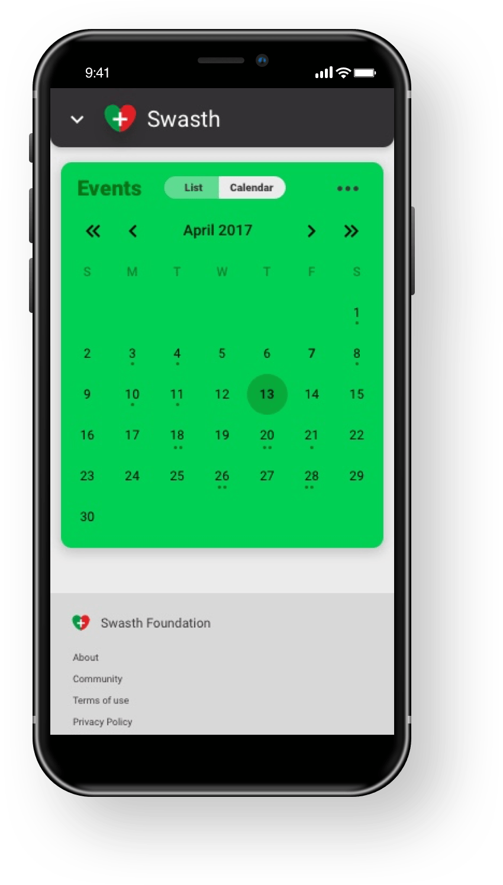

Swasth is an NGO based out of Mumbai, India. Swasth helps low-income families with free health checkups, workshops and activities to live better. As a part of these operations, Swasth conducts workshops and drills for all their community members periodically.

Swasth envisioned to build an application to manage and fasten their operations, used by their agents and end users.

I made sure to go through Swasth's operations on-ground and decided to participate in their drives on the field.

Much of the interactions, necessary resources, and processes are recorded and is replicated on the app design.

### Data Collection PWA

To ensure every user can access the application lite, I built the app as a data collection PWA (Progressive Web App) for ease of access, keeping the application light-weight on the phone.

