Itihása Collective, is a home for talented individuals in the filmmaking ecosystem. [Itihasa.co](http://Itihasa.co) aims to connect writers, directors, producers, and other filmmaking talent, facilitate story development, and create investment opportunities in movies and web series industry. The name "Itihasa" itself refers to ancient Indian historical narratives, suggesting a focus on storytelling with depth and cultural roots.

Itihasa Collective has a Writers Room: A Platform for aspiring and expert writers to collaborate on stories, from initial concept to final script. It offers opportunities to work on original Itihasa projects or co-create with industry stakeholders. The platform also provides expert reviews, feedback, and avenues to showcase stories to producers, OTT platforms, and directors.

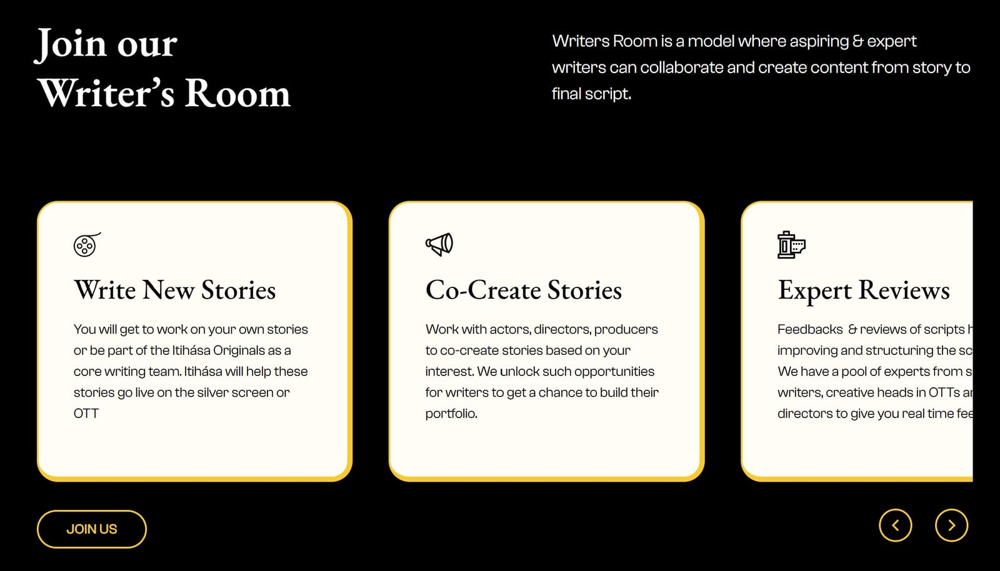

They also work on initiatives like Writers Fund, Film Investor Network, Book To Screen etc emphasizing building a community of creative professionals, offering resources, work opportunities, industry events, and creative spaces.

To digitise their operations and help scale, I built a platform for Itihasa to manage their scripts & opportunities and engage with their closed community.

"Itihasa Collective", an "invite-only exclusive membership for filmmakers & authors", accessible at [app.itihasa.co](http://app.itihasa.co)

Many days of brainstorming has gone into this project, with the Collective of writers and other crew, Itihasa’s team to dive deep into the operations and processes involved in sharing stories.

> It is a common practice to send the script.pdf over a whatsapp chat but it is vulnerable of plagiarism later and breach of IP. This felt like a good problem to solve.

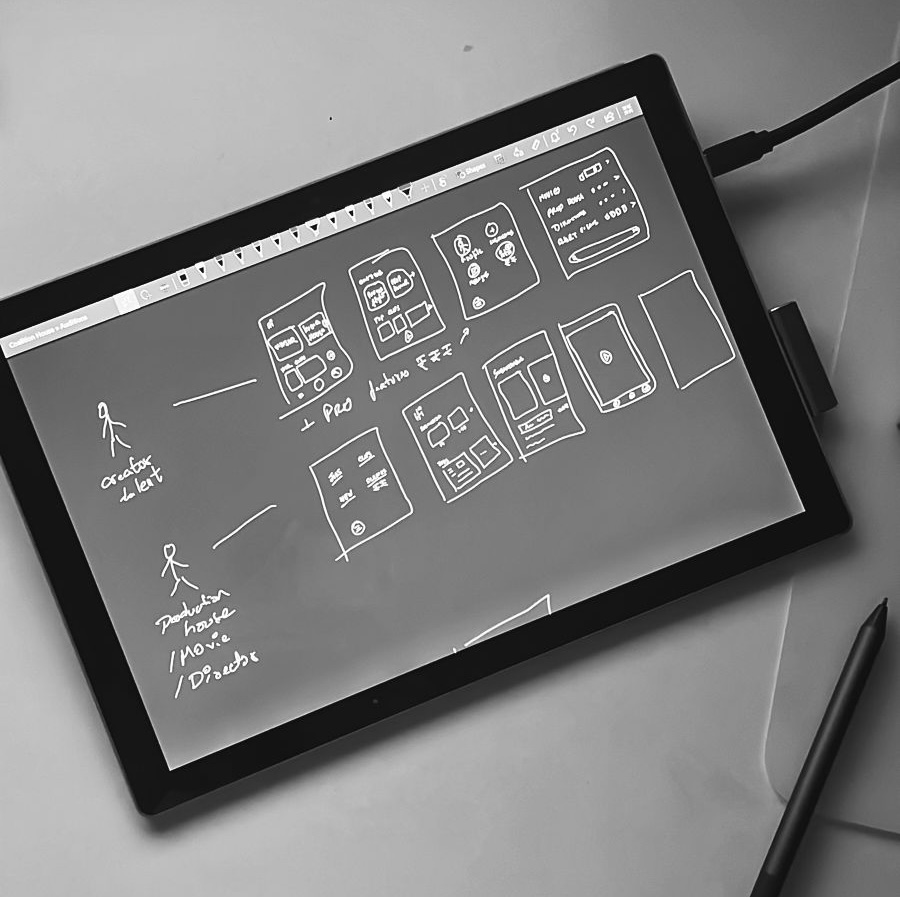

We went to the drawing board over many coffees to define the product, and its scope for v1.

We assessed the development resources needed for the project and decided to build on no-code when we realised all the functions of our product are feasible to be implemented on no-code and it takes 10x less time.

The app is entirely built on [Bubble](http://bubble.com), developed by no-code, building the database, workflows, UI and other product functions & plugins.

### Authentication

The app uses the traditional user email & password to login and a mechanism to send reset instructions when user forgets their password. I added a feature to 'generate a login link' to email so that users can click to login. This helps users who infrequently login to get easy access.

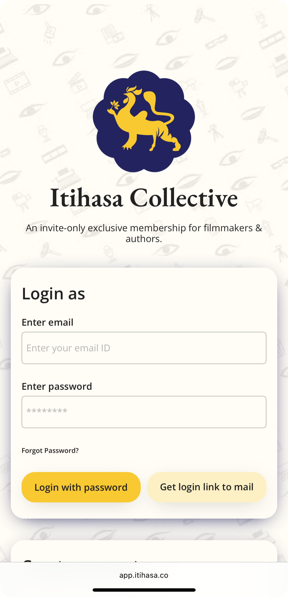

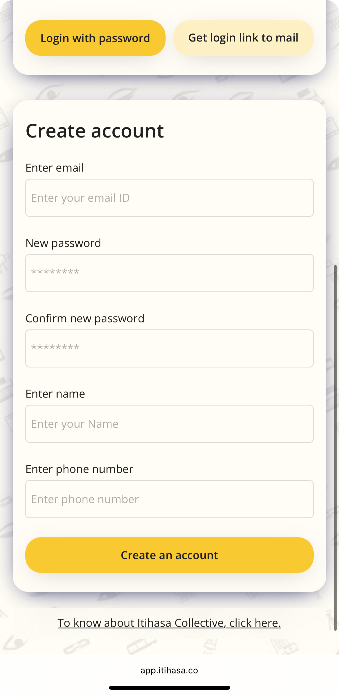

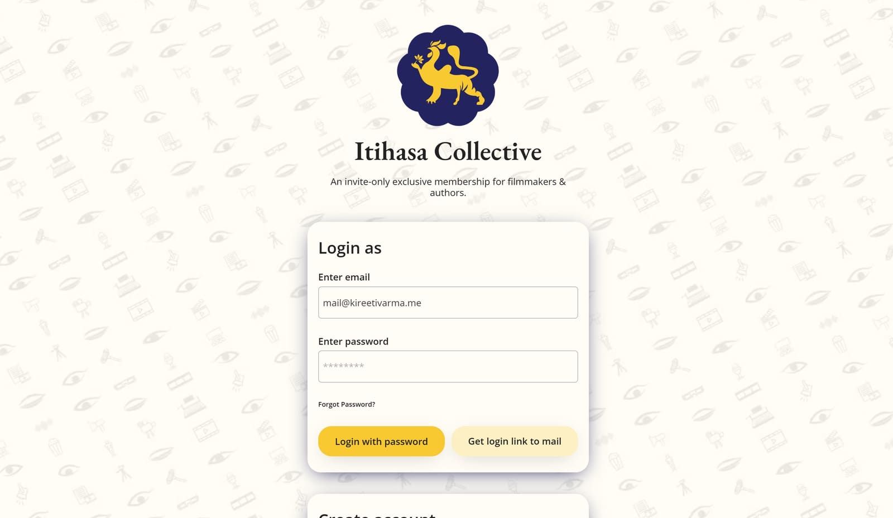

### Scripts & secure script sharing for writers

The app helps writers to manage their scripts on a single platform and share with the industry. Each story project will have a set of documents, like Idea, Pitch Deck, Summary, Screenplay, Dialogues etc. Once the script is approved on the collective, the project is eligible for secure script sharing for writers. Users can:

Create a new Script project, and write its details like language, genre, format, budget etc.

Upload documents

Submit script for review

Share script with the industry.

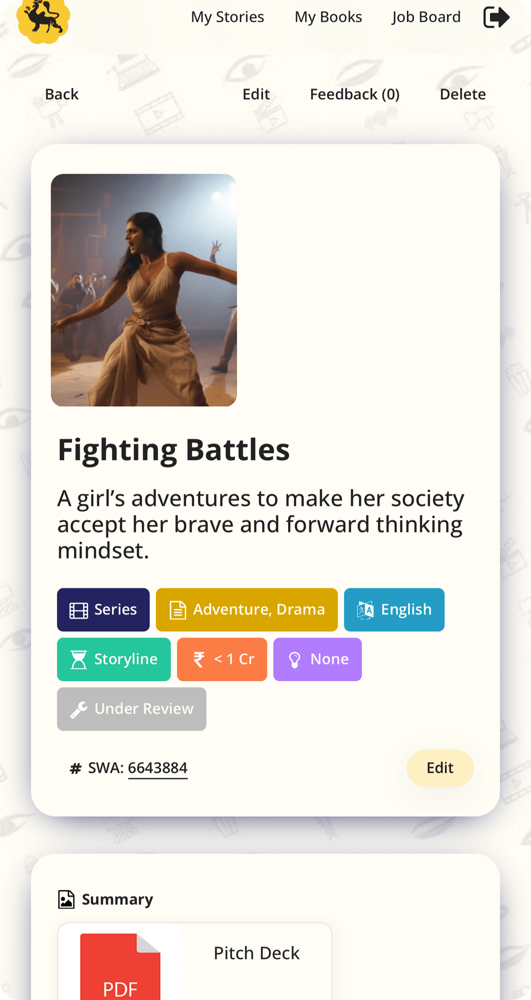

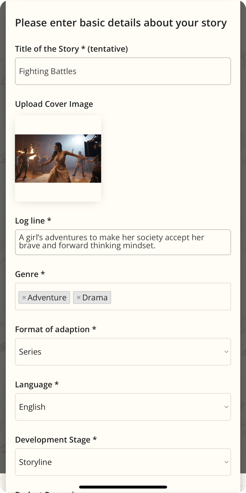

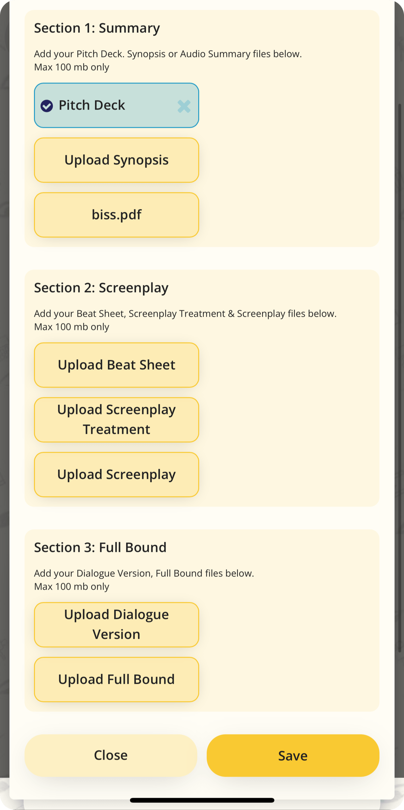

### Opportunities - Job Board

Itihasa Collective shares their opportunities on a board for its exclusive member community and accepts applications.

Users can

View all active opportunities

Apply for an opportunity with documents

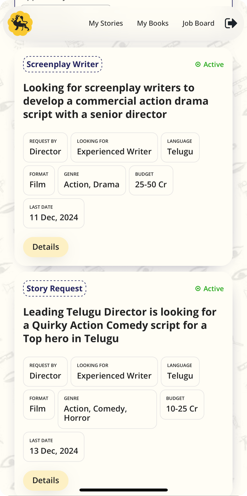

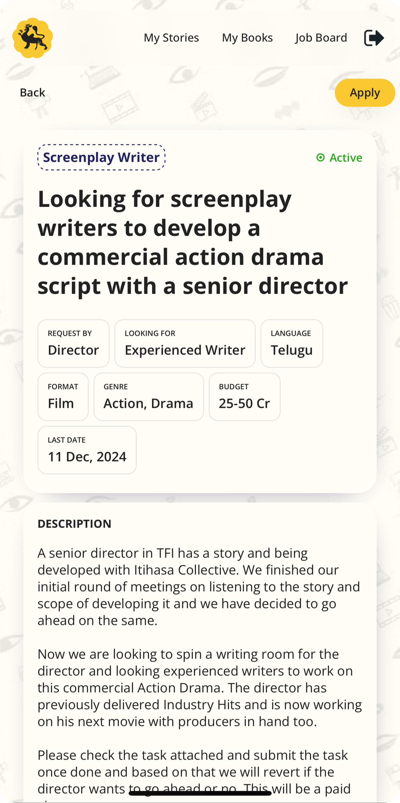

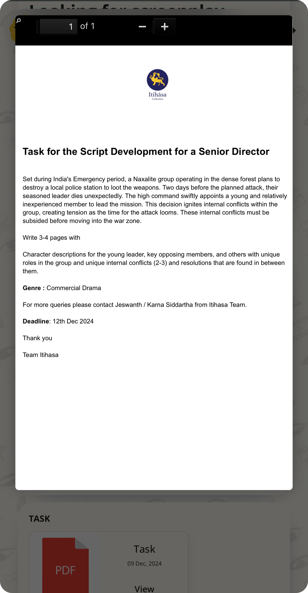

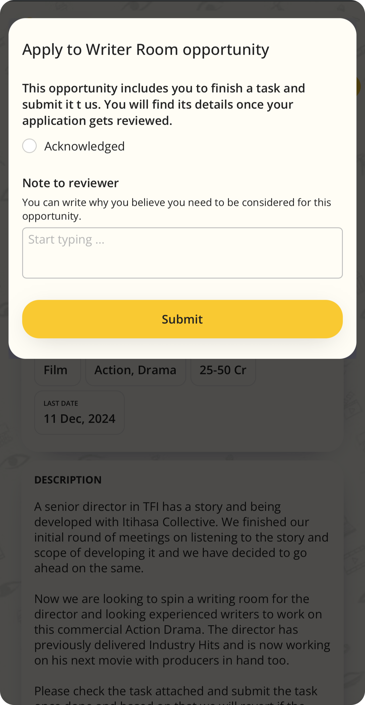

### Admin Console

Admins at the collective have an additional page access that allows them to control the operations and listings. Admins can:

Approve/ reject new users

Approve/ reject/ comment new story submissions

Create a new opportunity, add details & documents.

Review submissions and approve/ reject/ comment.

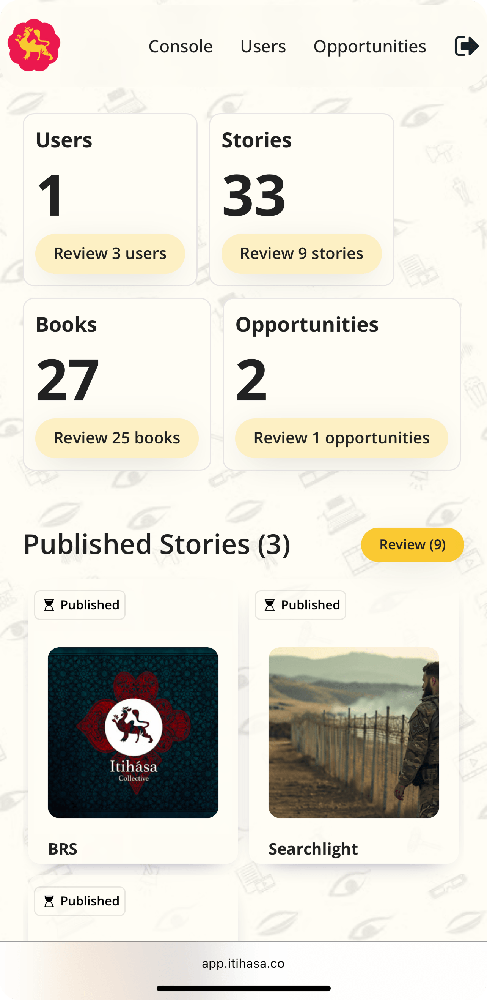

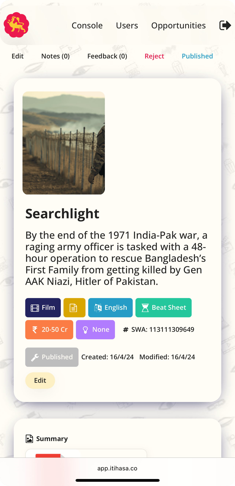

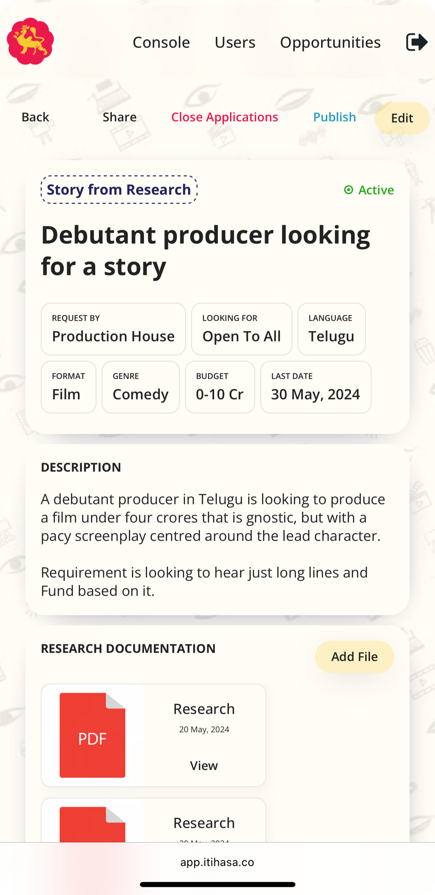

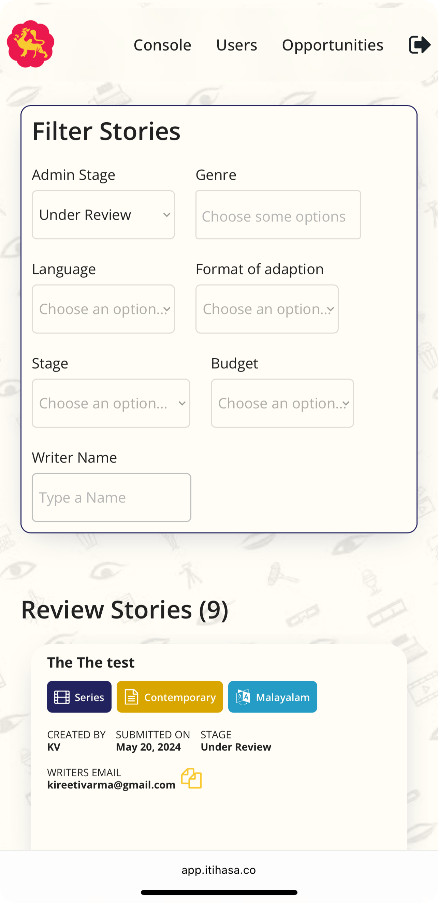

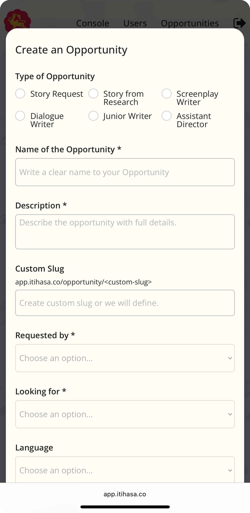

### Privacy - Secure Viewing of documents

Users can securely save their story documents on the platform as it maintains data-privacy rules to authenticate the viewing user, powered by Bubble. This helps the app determine if the user has permissions for secure viewing of document and only then render it, nullifying the scope of any breach.

### Email Notifications

Key actions on the app like 'status of a project under review', a 'new opportunity', 'status of opportunity submission' etc will send email updates to users concerned (Writers, Admins etc) for any operational processes.

### Notes

Admins can share a note with the Writer, while reviewing any document and revert it back. This helps to collaborate within the platform.

The app is released in April 2024, and is successfully being run within Itihasa Collective.
