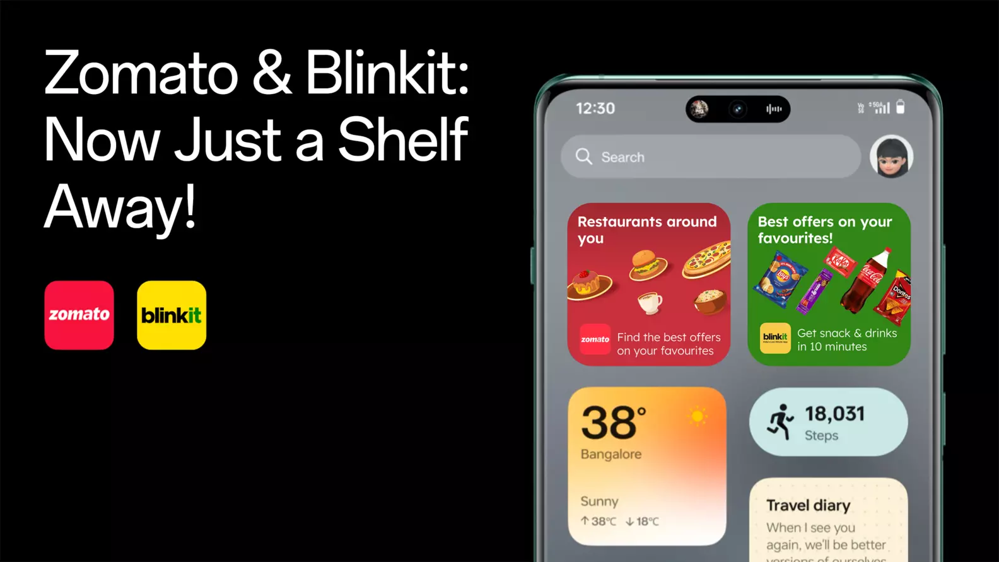

In the rapidly evolving tech industry, partnerships can result in significant transformations. A notable instance in India is the collaboration between OnePlus, Zomato, and Blinkit. This integration brings forth innovative widgets aimed at increasing convenience for OnePlus users, fundamentally altering the way they approach ordering food and groceries.

Starting in Q4 2024, OnePlus users will enjoy new widgets added to their Shelf feature, providing easy access to local restaurants and quick grocery ordering. This move aims to make life easier for tech-savvy consumers across India and redefine their daily experiences.

## The OnePlus Shelf: A Quick Overview

The OnePlus Shelf is a handy feature allowing users to access frequently used app widgets and tools right from their home screen. It serves as a centralized hub for important information and tasks, eliminating the need to sift through multiple menus.

With the introduction of Zomato and Blinkit widgets, OnePlus underscores its commitment to enhancing user convenience. These apps are essential in many users' lives, making this partnership a natural evolution in their service offerings.

## Understanding the Integration of Zomato and Blinkit

### What is Zomato?

Zomato has established itself as a leading food delivery service in India, connecting users to a wide variety of local restaurants. With just a few taps, users can explore menus, read reviews, and place orders for delivery or takeout. In FY24-25, Zomato emerged as the top profitable food delivery player in Indian market.

By embedding Zomato directly into the OnePlus Shelf, users can swiftly find and order their favorite meals from popular local spots. This streamlined access could encourage faster selection & more frequent ordering—something that is particularly appealing given that Zomato reported a 30% increase in orders during peak meal times last year.

### About Blinkit

Blinkit, previously known as Grofers, plays a crucial role in the grocery delivery landscape. Known for its promise of rapid delivery, Blinkit has become a go-to solution for busy consumers seeking a hassle-free grocery shopping experience. In FY24-25, Blinkit emerged as the top profitable grocery delivery player in Indian market.

Now, with Blinkit integrated into the OnePlus Shelf, users can order groceries effortlessly. This functionality makes it easier for them to plan meals without the hassle of traditional grocery shopping. According to recent statistics, grocery delivery services have seen more than a 60% rise in demand over the past year, indicating a strong shift toward online shopping.

*Zomato & Blinkit cards on OnePlus Shelf*

## How the Integration Works

The new widgets enable OnePlus users in India to interact with Zomato and Blinkit seamlessly. Upon accessing Shelf, users will see two distinct widgets—one for Zomato and one for Blinkit.

The Zomato widget shows a curated list of nearby restaurants, making it simple to order from popular restaurants. Similarly, the Blinkit widget lets users browse across items and place orders, all from their accessible Shelf.

This integration saves time and adds convenience to daily routines, catering to the needs of modern lifestyles.

## Benefits for OnePlus Users

### Convenience

The introduction of these widgets truly enhances user convenience by allowing individuals to receive personalised recommendations based on their preferred restaurants located nearby. Rather than having to switch between multiple applications, users can effortlessly order food directly from the Shelf, streamlining the entire process and making it more efficient.

Whether users are planning lunch or dealing with late-night cravings, the entire experience becomes streamlined and efficient—something every busy professional can appreciate.

### Enhanced User Experience

Simplicity and effectiveness are central to OnePlus’s philosophy. By integrating Zomato and Blinkit, the user experience is enhanced, allowing quick decisions when ordering food or groceries.

These widgets not only make the interface more engaging but also encourage users to explore available options easily. For instance, users might spend 50% less time deciding what to order, just by using these widgets, because you start already with your top favourite restaurant that's recommended at your location.

### Tech-Savvy Solution

OnePlus users are generally tech enthusiasts who appreciate having the latest features at their disposal. The widget integration aligns perfectly with their interests, offering a high-tech solution to everyday tasks.

*Shelf with Zomato & Blinkit cards showcased on [OxygenOS15 announcement.](https://www.oneplus.in/oxygenos15)*

## Future Perspectives

The collaboration between OnePlus, Zomato, and Blinkit signals a pivotal shift in how we view app functionality. As technology increasingly permeates daily life, expect more brands to pursue partnerships that enhance user convenience.

The integration of Zomato and Blinkit widgets into the OnePlus Shelf marks an exciting milestone in India's mobile innovation landscape. This partnership highlights the increasing demand for convenience and seamless interactions in our fast-paced world.

As the tech ecosystem evolves, OnePlus is setting a benchmark by introducing features that significantly benefit users. By making food ordering and grocery shopping more accessible, OnePlus is poised to enhance daily life for tech enthusiasts across the nation.

Look forward to the official launch in Q4 2024. The integration could very well help you pick your next order, faster.

Also: I asked Grok to review this feature, and this is what it said:

[https://www.kireetivarma.me/post/i-asked-grok-to-review-a-feature-release](/grok-ai-review-zomato-blinkit-widgets-on-oneplus-shelf/)
