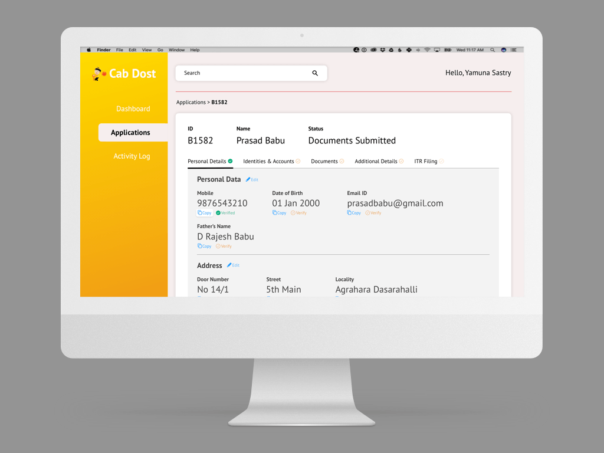
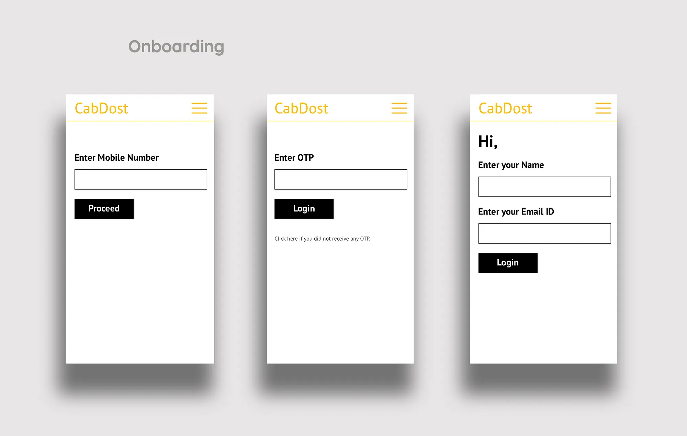
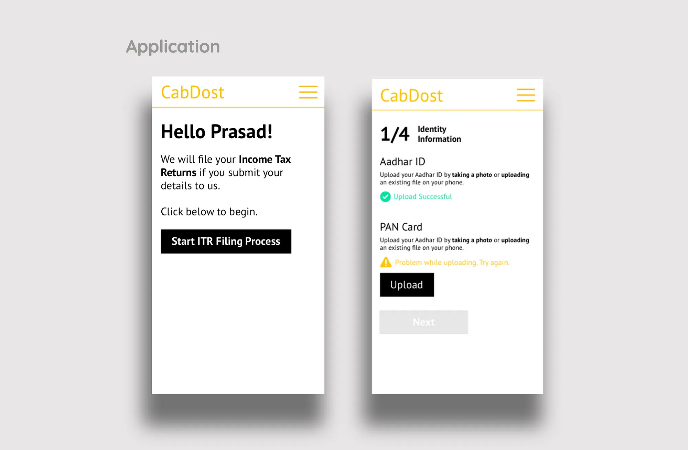
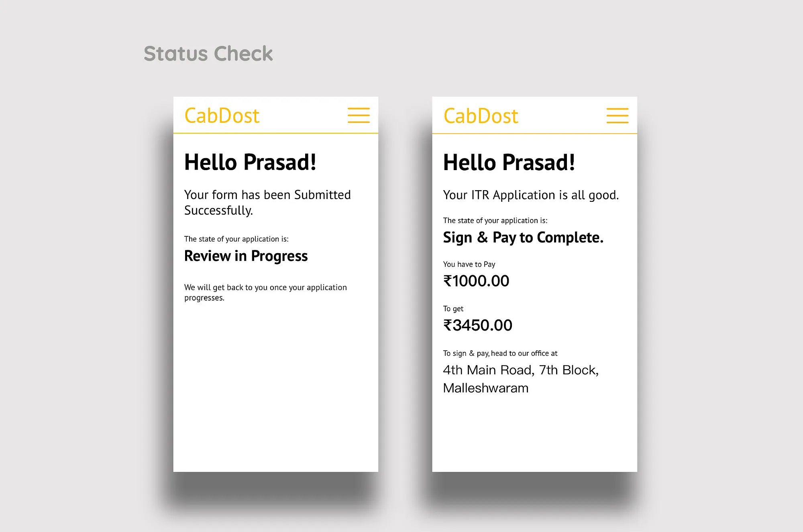
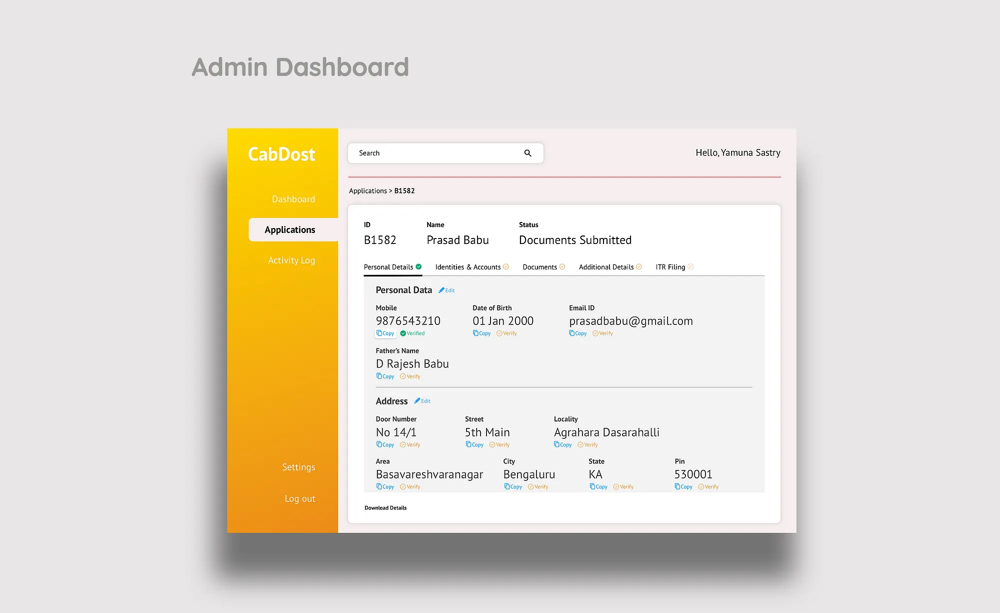
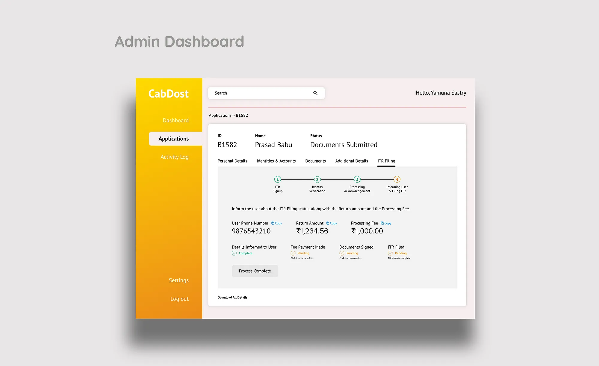

Cab Dost is an Indian startup that helps cab drivers to file Income Tax Returns. The driver’s community is not well aware of the returns they get at the end of the fiscal year. Cab Dost helps to bring awareness and file returns for them.

> In one year, Cab Dost helped 5000 cab drivers to get back close to 1.5 Crore Rupees ($175K), completely offline. We are helping Cab Dost to scale this formula.

## Requirement

Cab Dost requires a user end application that can gather all details, documents & payments from the cab drivers online. It also need a admin end application that assists the agents to file returns for the drivers. By using a scalable product, Cab Dost wants to help drivers across the country to file tax returns.

## Approach

We started with User Research for the product and its viability to check if cab drivers will use such a product if built. We asked close to 100 drivers about some basic details how they want to use the application and what elements would smoothen the process.

Interestingly, most drivers\* tend to forget passwords, got accustomed to the user experience on the different cab aggregator apps. We also had to understand different problems of the cab drivers like the hierarchy above them who decide how much pay they get or how they get paid and to how many transactions they get invoices and so on. All these details are crucial to understand what the driver will have on mind while opening our application and what data will he be prepared to provide. Once we had the desired results, we analysed the responses to design the user flows and the customer journey for the application.

A rough sketch of wireframes is then shipped out and analysed to understand and design the functions of a user and also defined the information architecture. The user end application will have 9 screens during on-boarding & filling the application and 10 pages on the admin dashboard with multiple states to facilitate the agent during the first version.

The minimal, clean design adapts for the nature of understanding of an application by a cab driver, who has not used many apps like any other internet individual. Internet and application have been introduced to the masses in India after the recent surge of internet availability at cheap or free rates. This helped millions of users to come online to explore other applications who otherwise earlier have just sent messages on Whatsapp.

As the cab drivers commonly use Uber, Ola or other cab aggregator apps, we’ve studied how simple the design of these applications is. Considering their usage, they are more accustomed to or are pretty much aware of the design languages of these apps from black rectangles to loading GIFs, I’ve mostly used these cues from the already existing app that a driver is using to design the user end application for the drivers.

As a result, during the alpha testing of the application, the first driver who used the web application could simply use the app to fill his application within 3 minutes. Even though he doesn’t know english, the familiarity to the header terms like Aadhar ID, Bank Account Number, which are quite evident at other places too, he could easily understand each section and its function.

Cab Dost’s agents need to have access to information required to copy and paste at a return filing site to complete the process. Until this product is live, the team used Excel sheets with colours, cell data as filters. The Excel sheets have less data security and are vulnerable to data loss due to unintended negligence. The dashboard helps at solving the first level problems as of this release.

In the upcoming phases of design and development, more problems will be solved in terms of usability and improving the experience. Some of the features we would be introducing are showcasing the user end application in many vernacular languages, introducing a payment gateway, provision to chat with the team.

While we are focussed on scaling up Cab Dost’s efficiency, our interests stay with all the stakeholders to solve problems for everybody who is involved.

> I could apply for filing returns in less than 3 minutes. This is much faster and easier than coming to an office. An Ola driver from Bengaluru.

We had many such drivers who were happy to file IT Returns, online!

\* From the survey conducted with cab drivers from Ola, Uber in Bengaluru during May, July 2018.
