Tymline is a social blogging application that helps users to create multiple timelines of their choice and share them with anyone. Tymline helps to organise multiple media and links on a particular topic in chronological order.

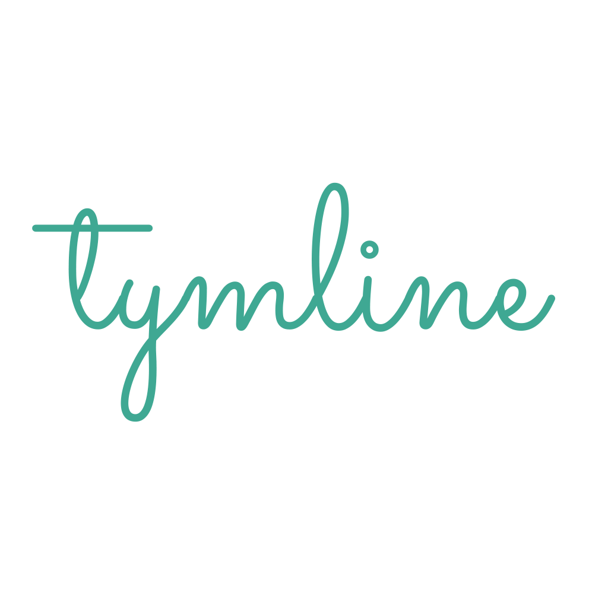

I conceptualised the idea of Tymline, along with two others ([Siddharth Ram](https://medium.com/u/6080b092f997?source=post_page---user_mention--ef0bd11eb0e4---------------------------------------), [Venkata Ram Harsha Kuncham](https://medium.com/u/fc4ec2d16f61?source=post_page---user_mention--ef0bd11eb0e4---------------------------------------)) who I teamed up to build this product. We drafted the product’s core intentions, the product’s narrative and build it quickly in less than couple weeks.

We started working on this project in August 2017 where I began my work in finding the problems faced in representing information or data online. The core intention for this product is to help any organisation, a startup or any individual to be able to create multiple timelines that he wishes to represent or showcase.

Like for a startup, Tymline can be their product change-log, product feature pipeline or their segmented blog that they want to create.

We have evolved Tymline from sketches to a visually appealing product in 3 months of time. Here are the different versions that we have built for Tymline.

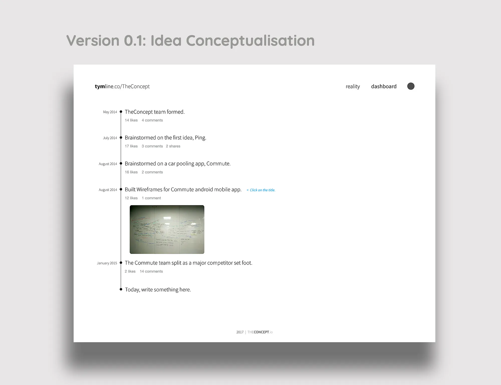

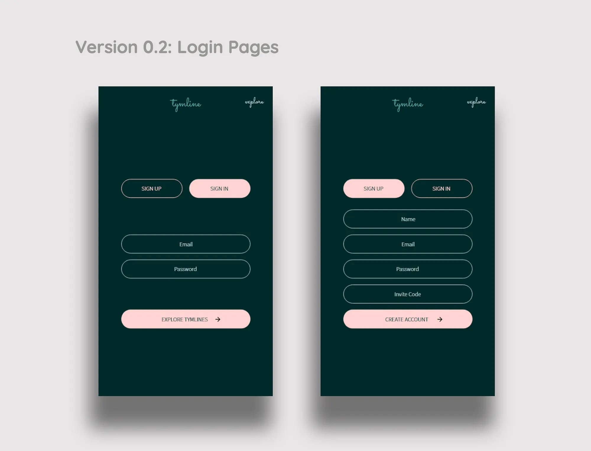

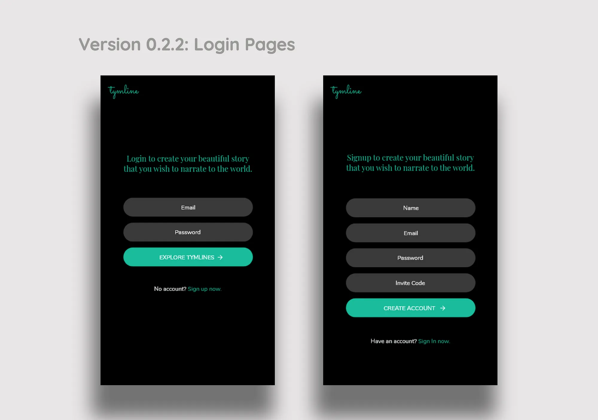

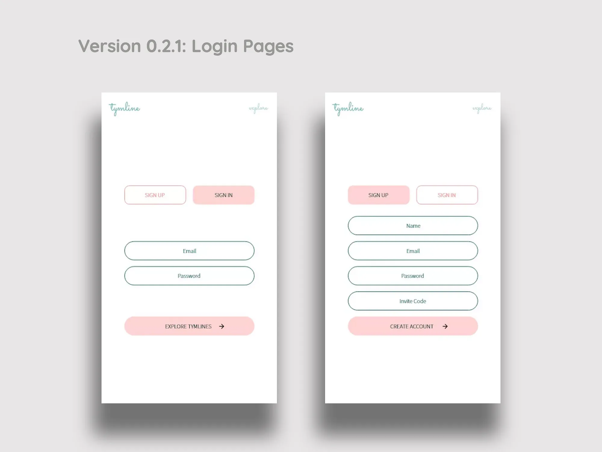

We’ve decided this version of the design language to be appealing good visually and solving the basic necessities of a signup page from understanding a text input box to understanding where to go if the user doesn’t have information that he has to provide. We then started digging deeper to design the rest of the pages, in similar fashion.

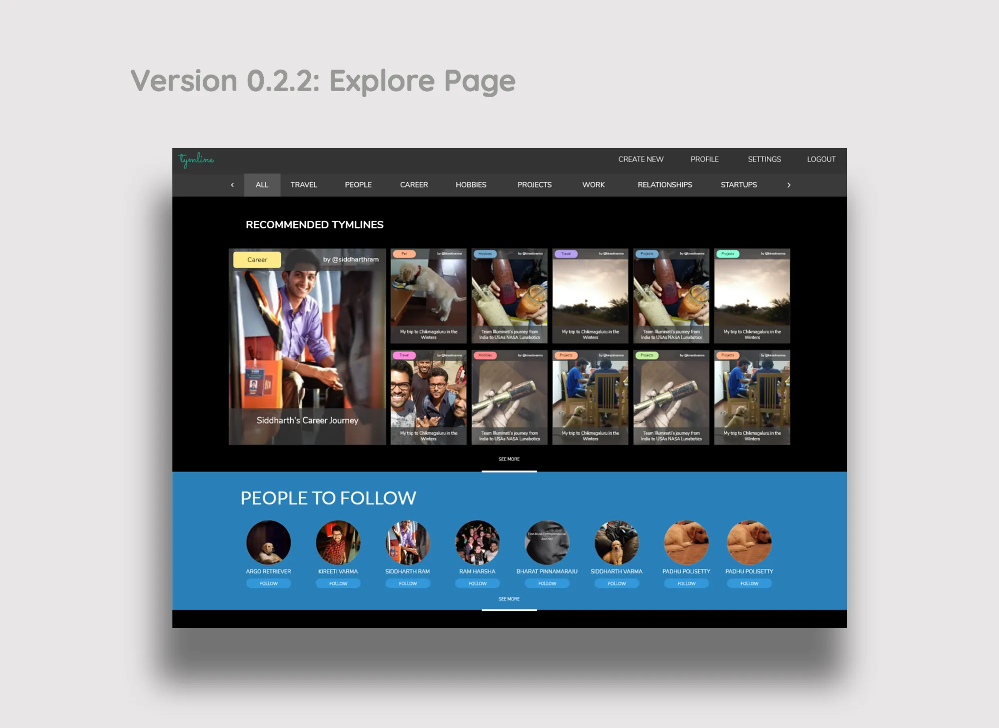

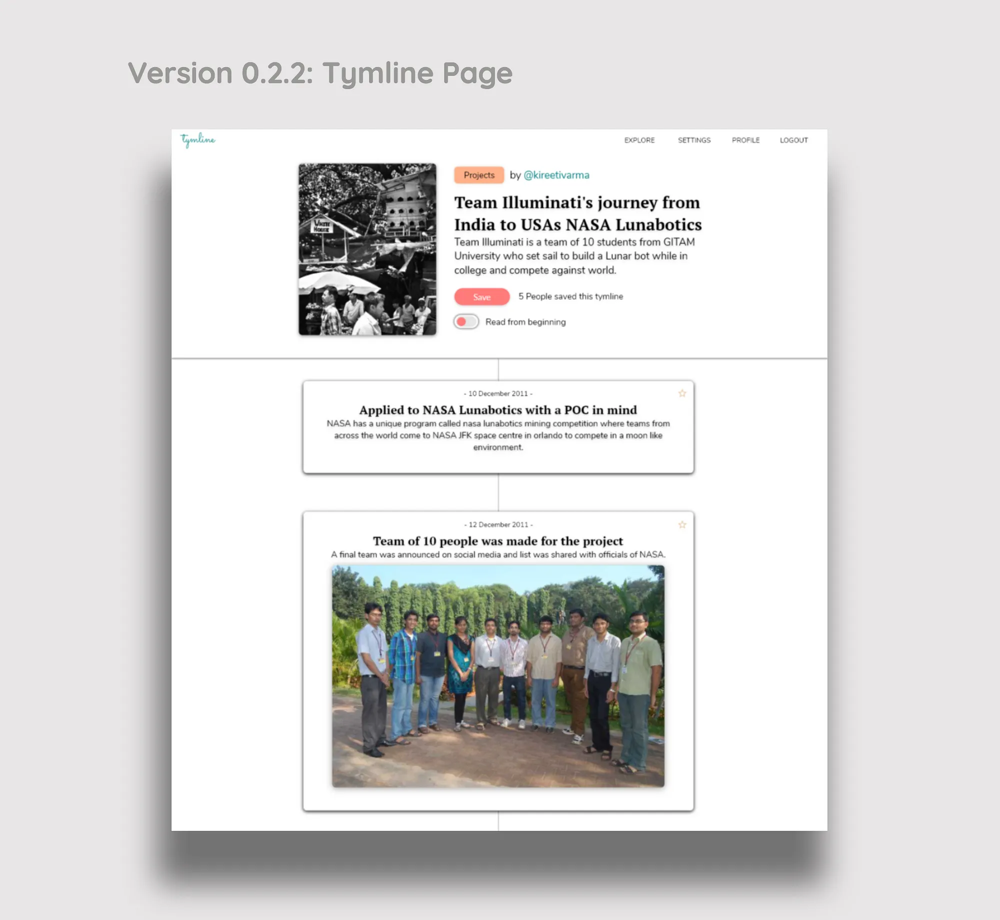

These mockups we prepared earlier also were redesigned to suit the latest arrived design language.

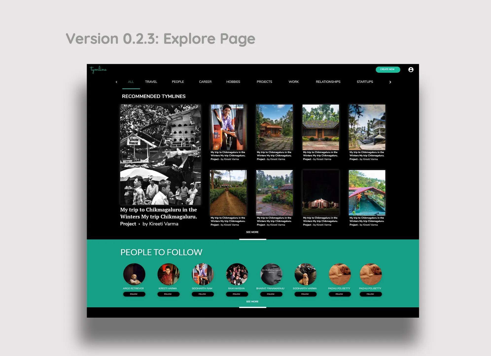

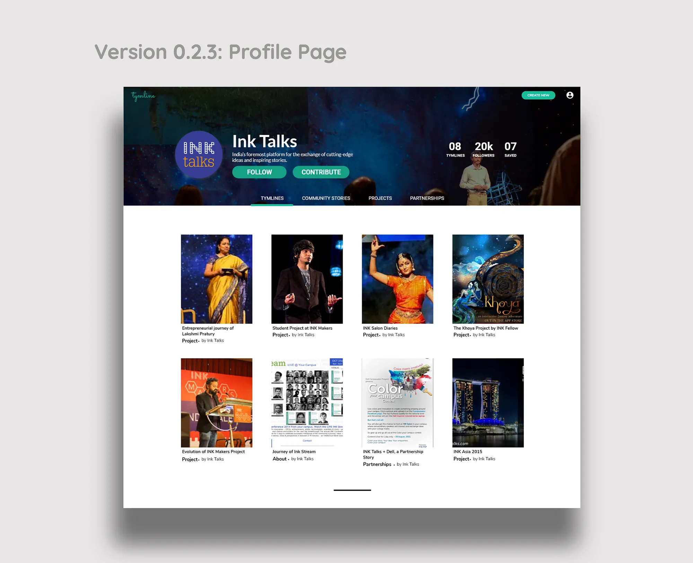

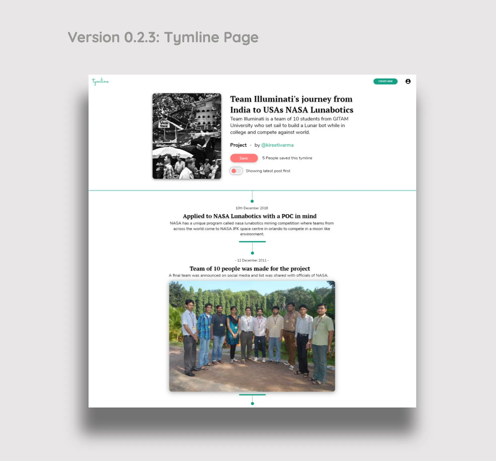

The designing of individual components like a post component, or the tymline page header component took effort in deciding the content representation visually.

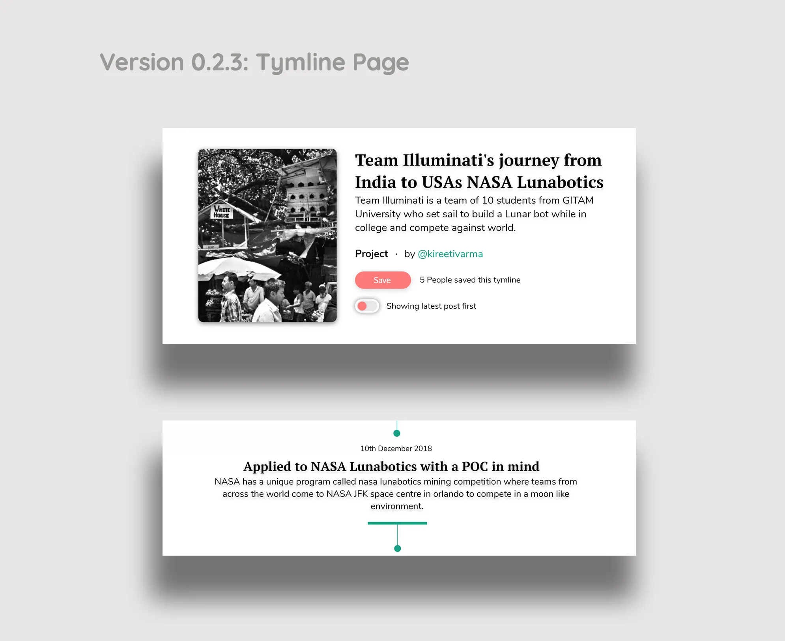

Our Journey keeps continuing in finding better user experiences and implementing them and experiment with users all over again.
