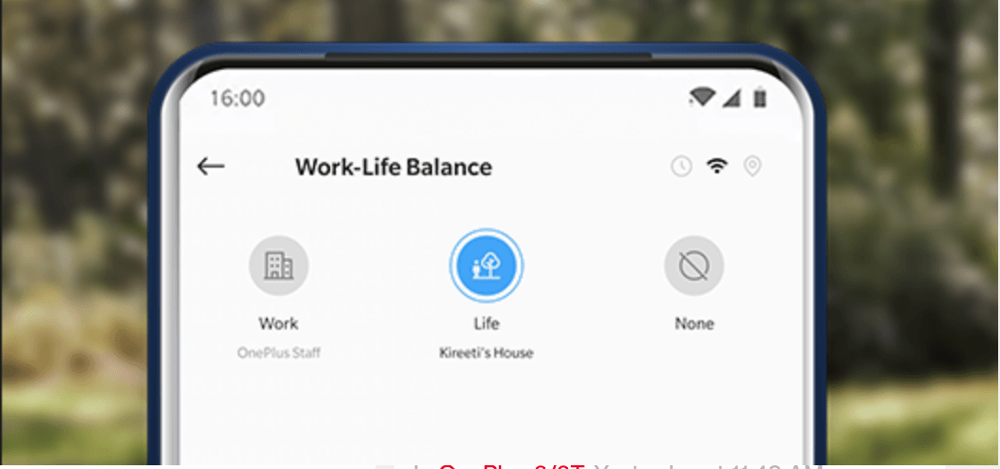
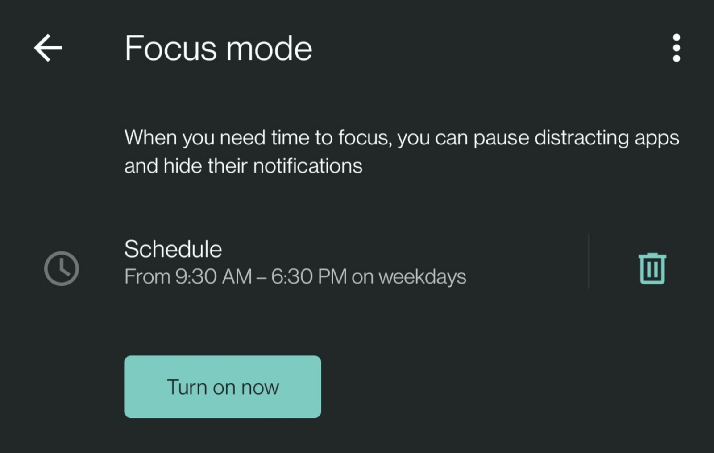
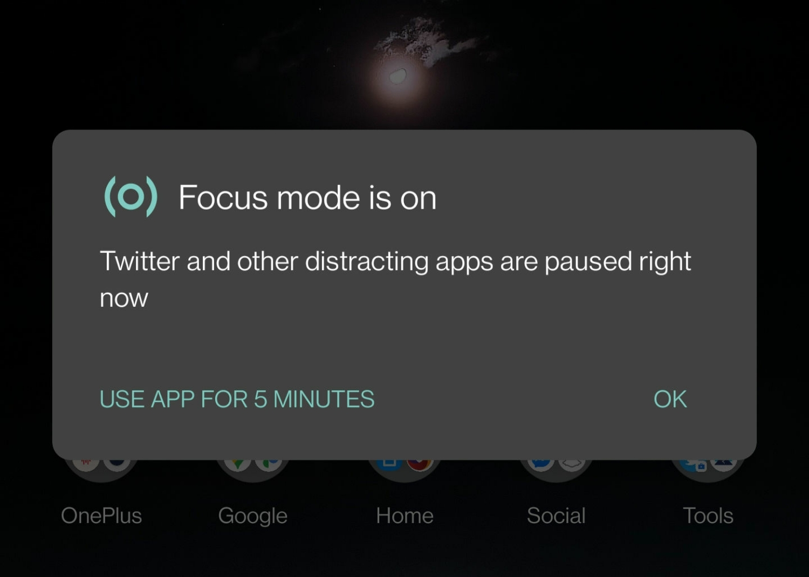
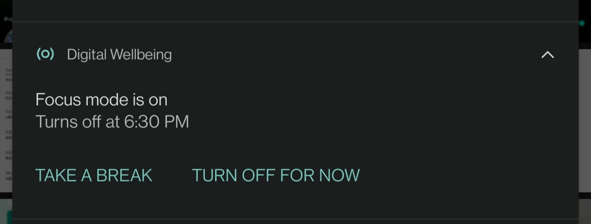
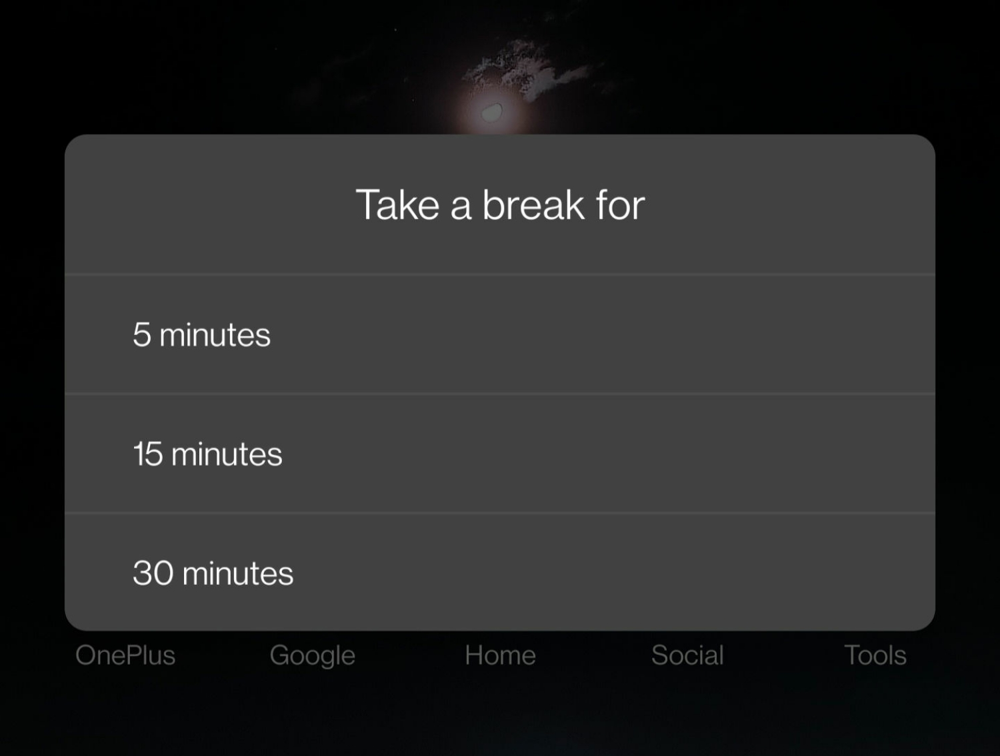
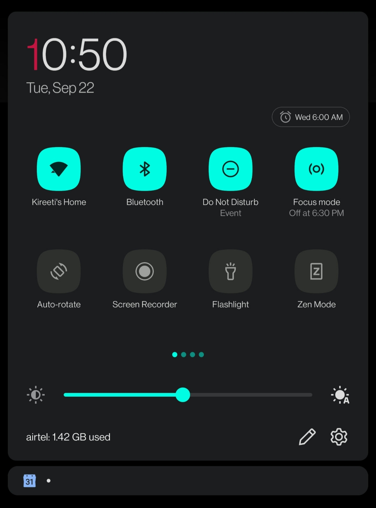
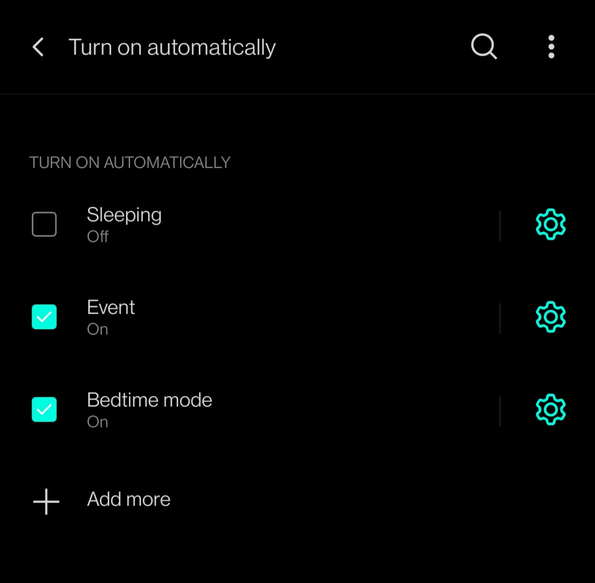
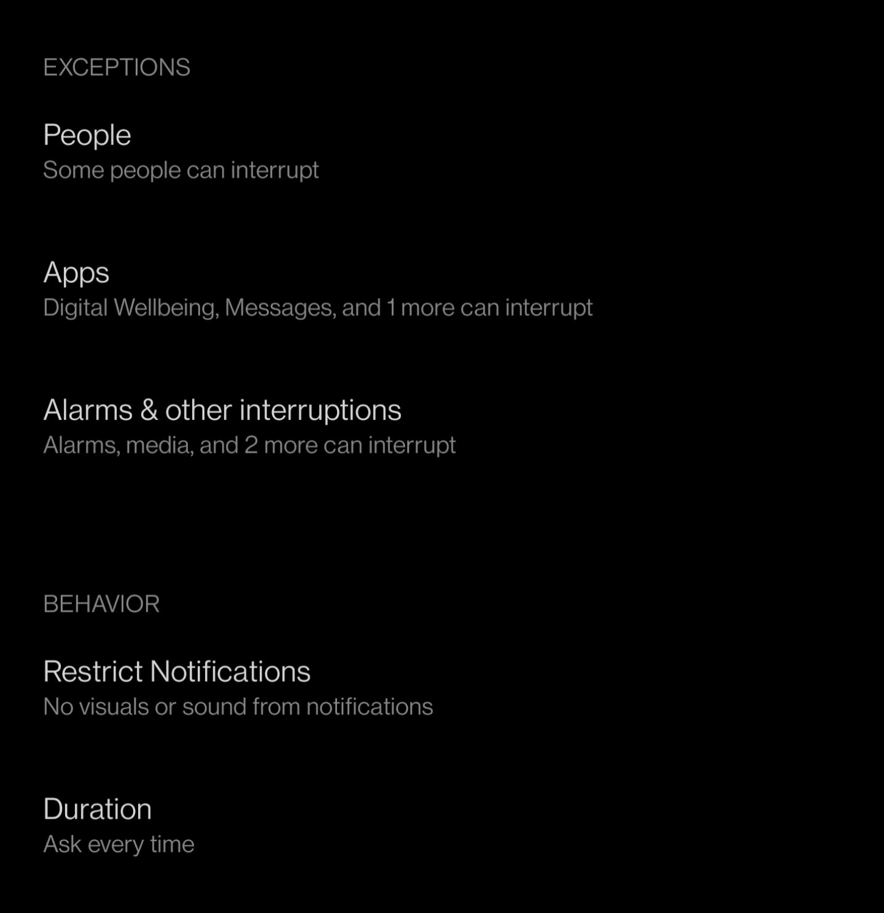

With the increase in screen on time during the work from home, it is quite a task to keep ourselves away from the distractions.

Team chat & calls on mobile and work, meetings and presentations on the laptop - we've been distracted quite often - atleast me. Sometime when I looked at my usage stats to check the unlocking rate, I discovered my screen time to be pretty high at 10h+. Though most of the time is spent on work apps, it still sounded wierd.

I then started using a few modes on my OnePlus 8 Pro and this helped me cut down the screen usage time to 3-4hr a day. Some of them are below:

## Work-Life Balance (or Focus mode) for work

WLB helps in disabling apps that are not necessary for the moment and let you work or keep-off from work well. In this case, I have set-up my Work mode and selected app that I don't want to use when I'm at work & also triggered to auto-enable when I'm connect to office WiFi or by time (because of the pandemic & WFH).

Alternatively you can also use the Focus mode from Digital Wellbeing in a similar way (but you don't get two modes of Work & Life though).

WLB or Focus mode, both help to keep off from opening the applications that give heavy dopamine swiping content and keep you hooked to the app. Basically greyed out icons on the home screen or app drawer and if you or any other link or app tries to open these apps, you see a warning.

This is where i religiously decide if I need this right now. And if it is necessary, probably for work, I give it 5 minutes to use and close. Else it does what it says. Shuts the app.

WLB/ Focus mode run through the office timings all weekdays. And well, I manually turn it on for extended work timings ad-hoc.

And sometimes when I need to access an app for work, I take a break from the Focus mode and define the time I need the break for. This helps me comeback to resume and keep a tab if I'm lost in any app. 😅

## Auto enable DND for events

The second best trigger is enabling DND (Do Not Disturb) for all events. With only exceptions to calls from starred contacts, there will be no notifications or sounds from the phone.

This helps to focus on the meeting and not attend any calls whatsoever.

This smoothly synchronises with the calendar app (I've added my work calendar to Gmail) and switches when event begins and off when out. We can manually turn off as well.

## Some productivity boosters that work well with the above

Create events for focus work along with meetings so that the DND works like a charm and doesn't disturb you.

Scheduling these meetings before Monday mornings for the whole week.

### Bonus

I also enable night light triggers between sunset & sunrise to keep off less blue-screens and also auto-trigger DND during bedtime. Sometimes Zen mode helps to get to bed.
