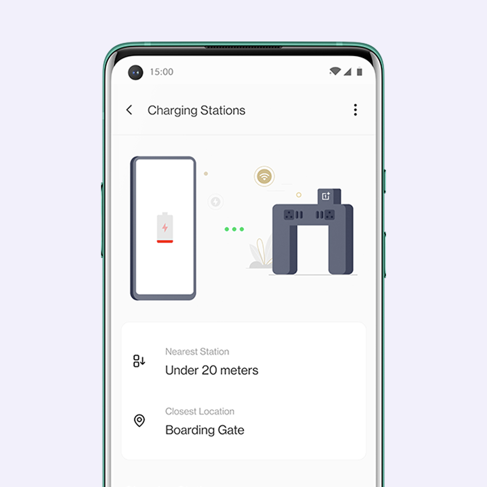
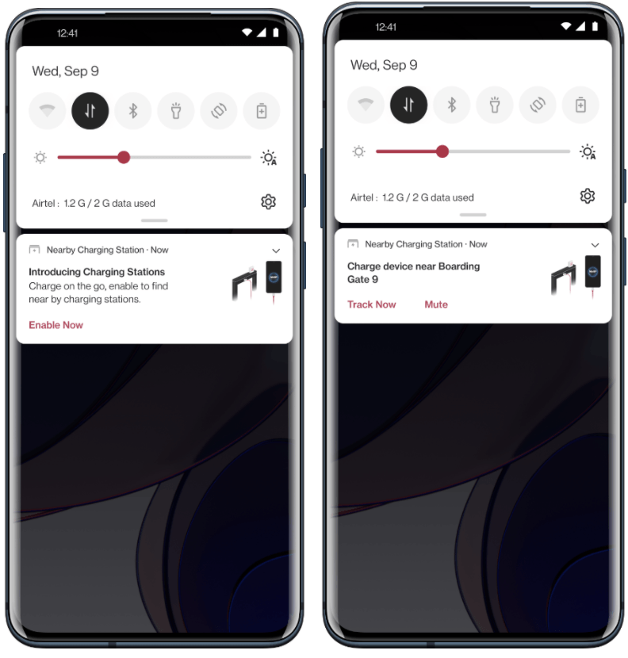
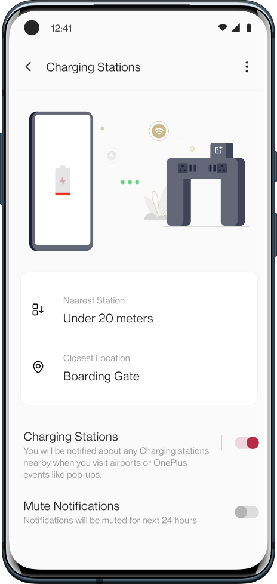
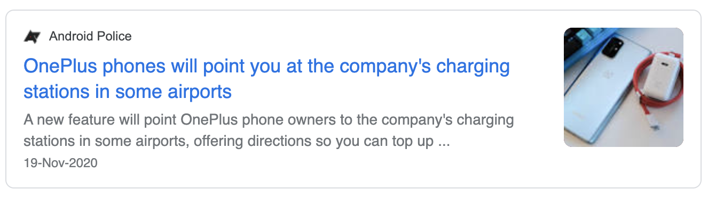
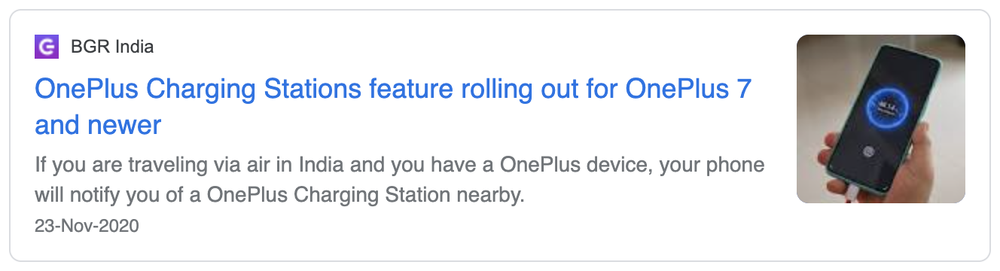
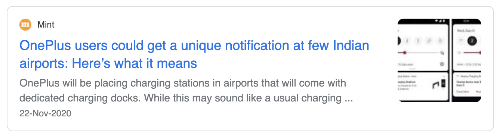
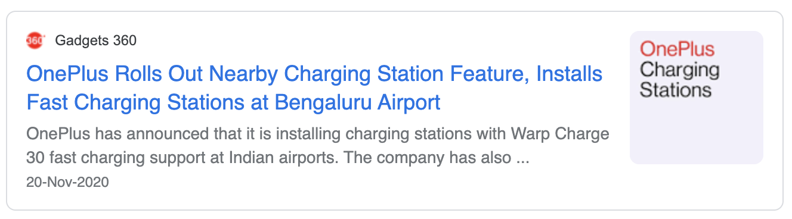
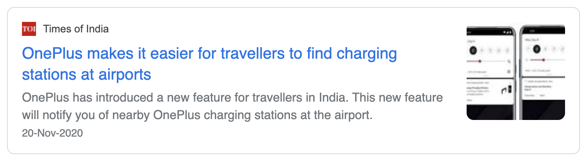

Even if we plan to start to the airports at 100% charge on phones, we often end up at lower charges by the time we board. A fast-charging station might be of quick help with jumping the last 20-40% of charge in about probably 10 minutes than spending 30 minutes at a regular wall charger. To make that easier, we installed fast-charging stations at few airports in India and came with a feature on OxygenOS, tailor-made for Indian users. This convenient new service on your phone will notify you of the nearby OnePlus charging stations at the airport. Not just that, you can also track the station and the distance to the closest ones. With the help of beacons integrated into the charging stations, your OnePlus device identifies charging stations nearby. You can mute them anytime if you're stuck in the long halts at the airports.

### Duration

January 2020 - August 2020

### Role

Product Manager for the team at OnePlus. Brainstorming, Architecture design, Content Strategy, Testing.

### Background

We started working on this project with a motive to help pro-users who travel and would welcome additional charge before boarding the flights for offline consumption.

### OnePlus Nearby Charging Station: How it works?

We installed beacons inside the stations to communicate with devices within close proximity and alert our service to trigger an action. When a user is closer to the station, they will be alerted with the location and approximate distance from the user. This helps the user to navigate to the station at times of urgency.

### Release Process

With the installation of the charging stations going in parallel, we shipped the service to the users' mobile devices hidden with an ability to enable them over a server when the devices are installed and ready at the locations.

### Press Coverage

Various top media outlets have reported and promoted the service as it released.

