OnePlus Shelf is a page where users can access OnePlus services like Sports, Memo/Notes, Toolbox, Storage data, Buds controls, health stats from watch, and app widgets.

### Duration

January 2021 - October 2021

### Role

Managed a team of design, development, testing, operations for brainstorming & conceptualising, analysing user feedback & conducting research, designing UX, UI and animations, messaging, and testing through multiple release cycles in closed & beta versions.

## Background

On OOS10 and earlier versions, Shelf used to be at -1 screen from the home-screen. With OOS11, Shelf has been moved to swipe-down from home screen. This resulted in huge downfall in usage. We decided to increase user adoption & usage to the feature by provide it universally, to be launched over other apps & also even if the launcher has been changed.

Sprints began in March 2021

## Research & Brainstorming

We started with collating feedback from our users through the community using survey and user interviews. Validated few concepts and took feedback from users on the most accessible and universal entry point. We also assessed the need for existing cards on Shelf and also understood the need for new cards like Weather, Storage & Data usage, Buds & Health stat cards.

## Designing the application

We wanted to refresh the interface and improve the experience for certain flows like resizing, drag to arrange order, pull down to search etc.

Cards like Toolbox and Notes have multiple sizes which have different capabilities in each size. We introduced new cards for weather information, health stats, buds pro controls,

We introduced animations for opening & closing Shelf, and the transition of the foreground app; opening & closing Scout by pull-down from Shelf page.

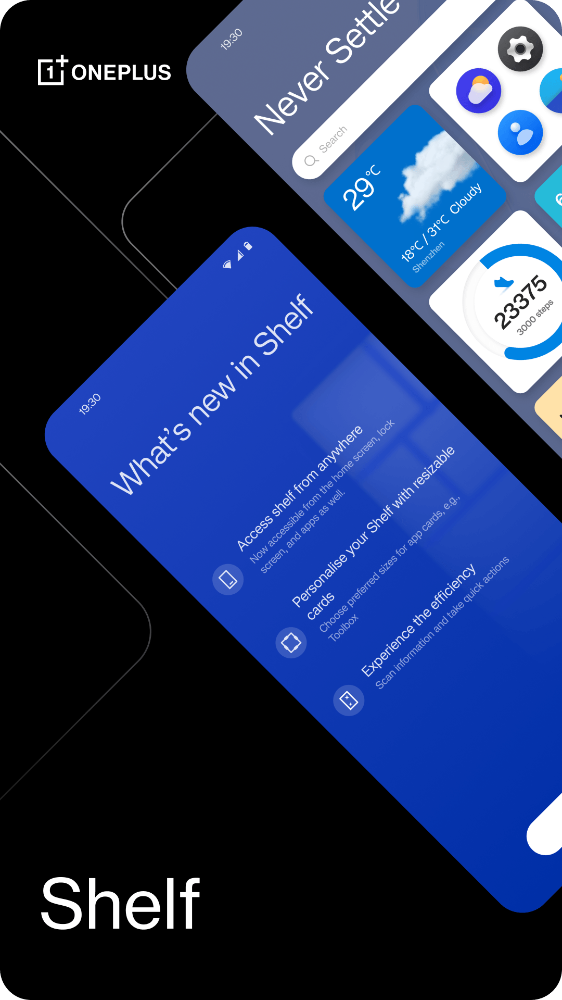

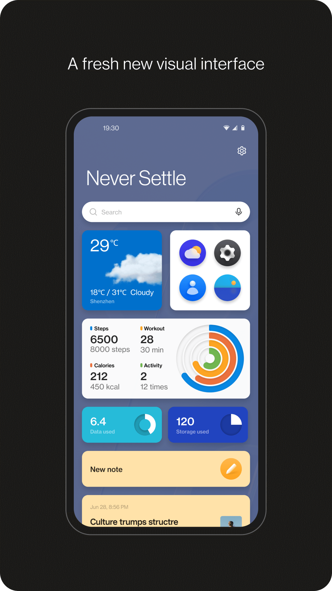

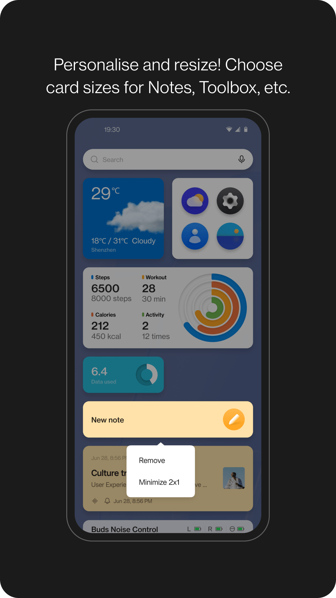

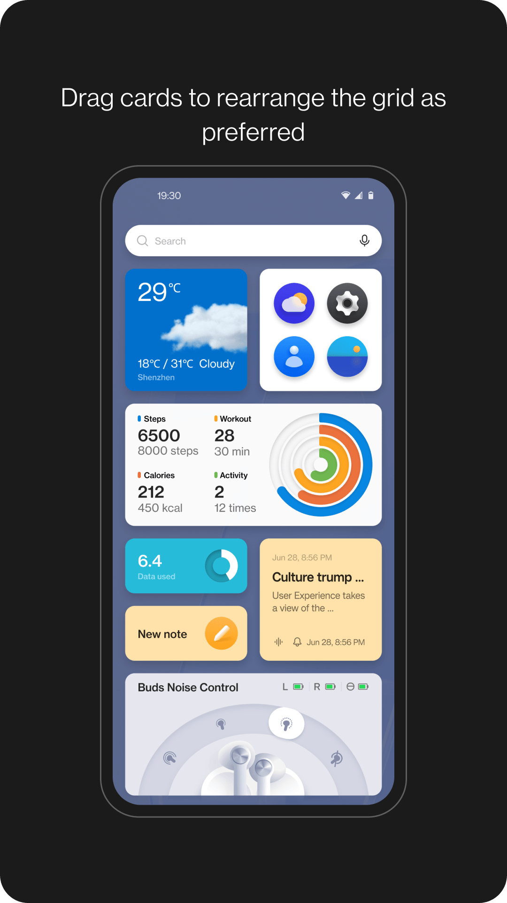

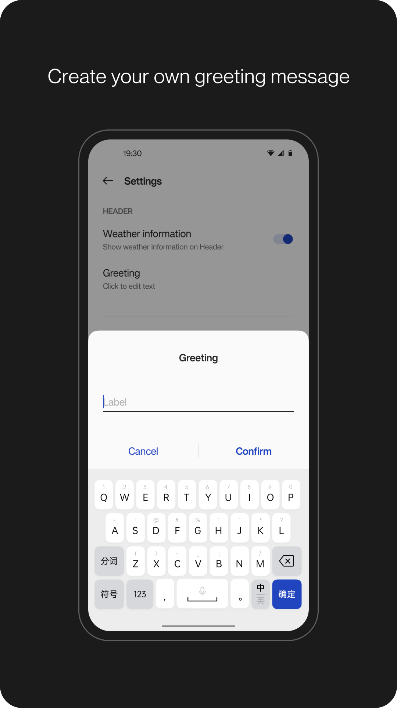

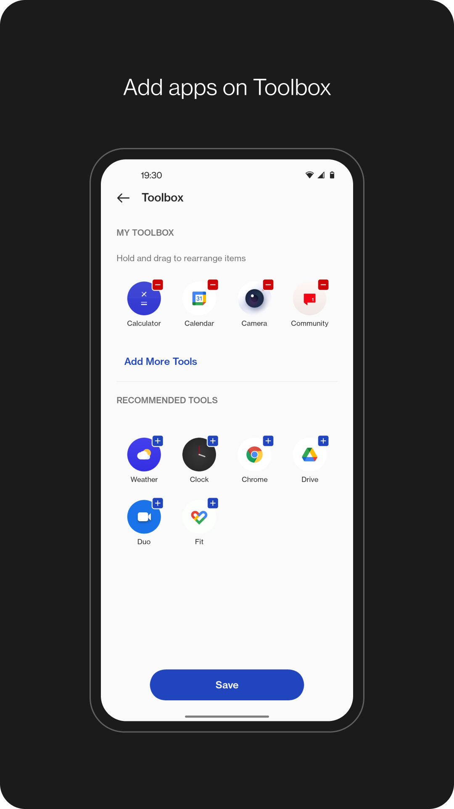

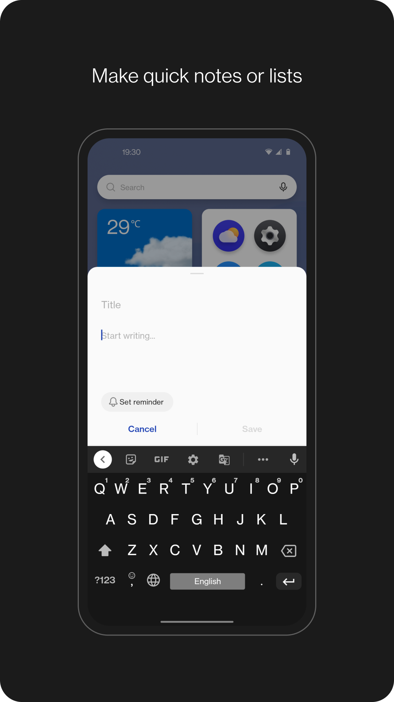

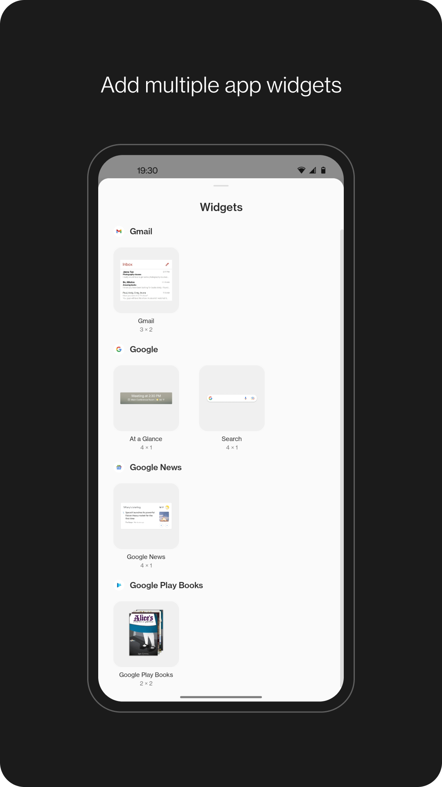

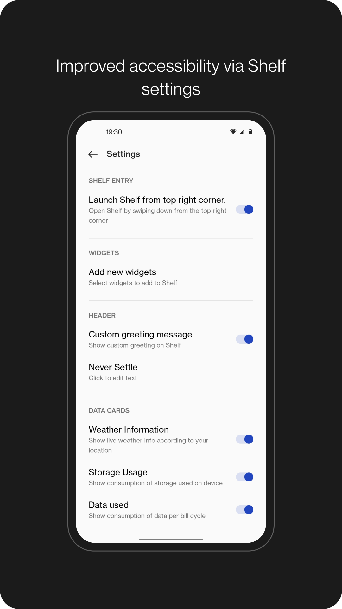

## Testing and Feedback

We iterated the product with initial feedback from our closed & open beta testing groups to improve the experience and fix initial bugs on the page. The early feedback allowed us to anticipate the known issues while our team has started working on the improvements even before it is released to mass production.

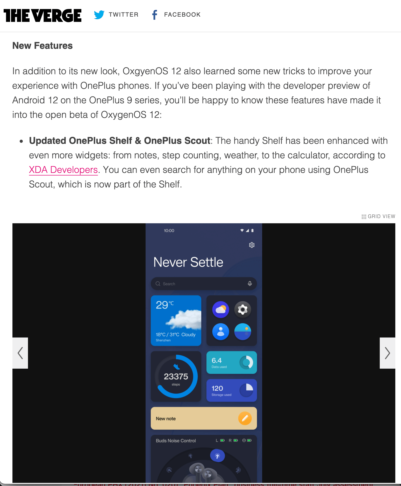

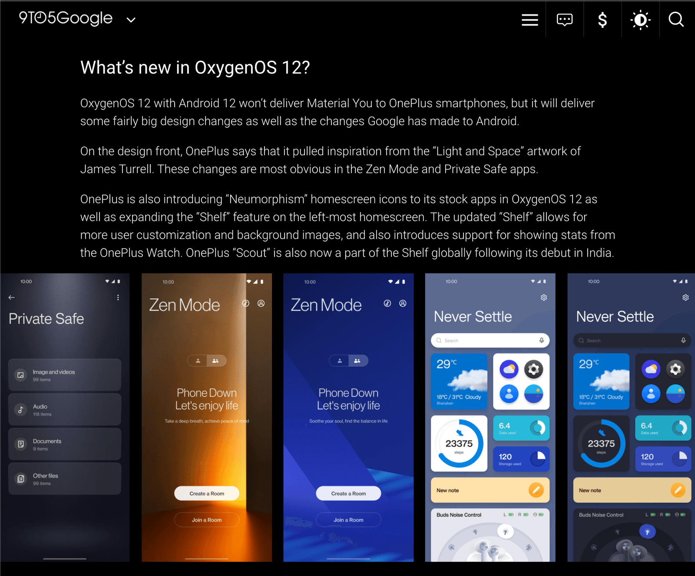

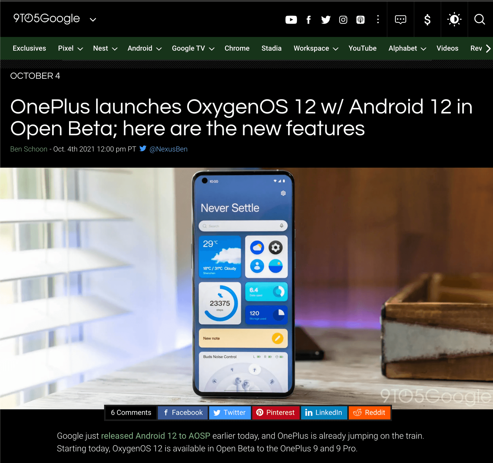

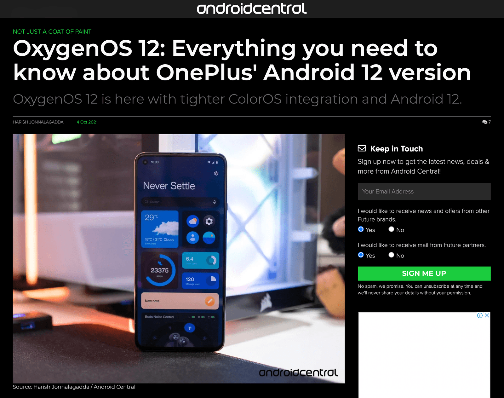

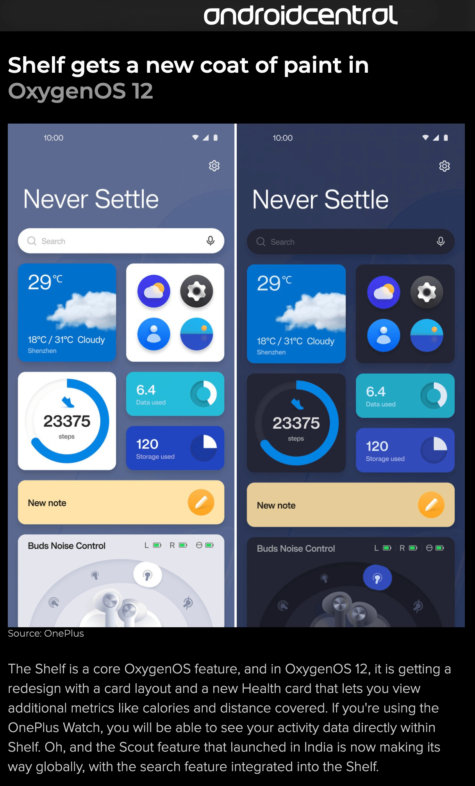

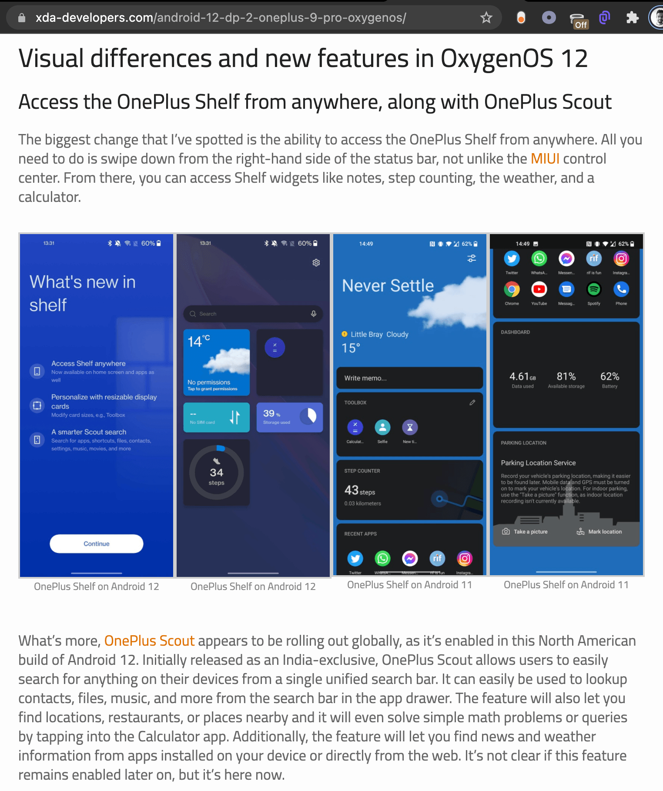

## Release

The app is one of the Key Selling Points for OS12. OS12 released on OnePlus 9 series devices in Q4 2021 and for the legacy devices later.

[See OS12 Forum Post](https://forums.oneplus.com/threads/explore-more-on-oxygenos-12.1500773/) here.
