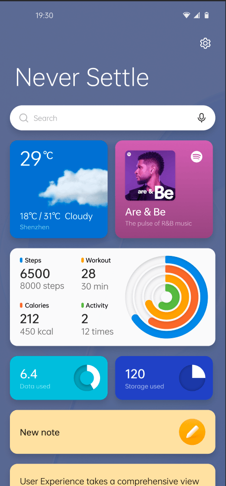
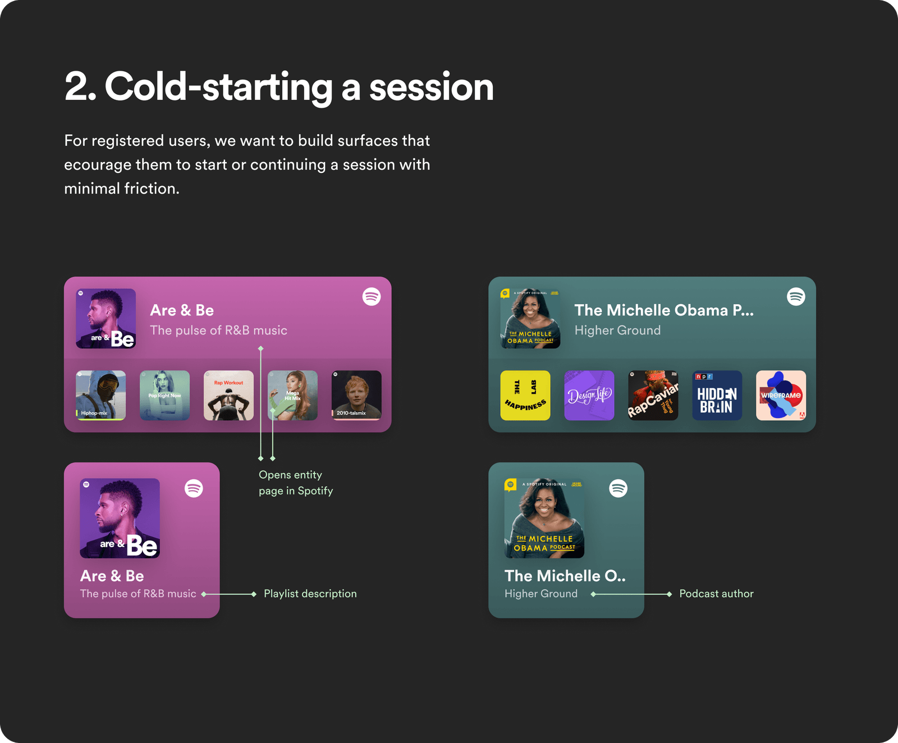
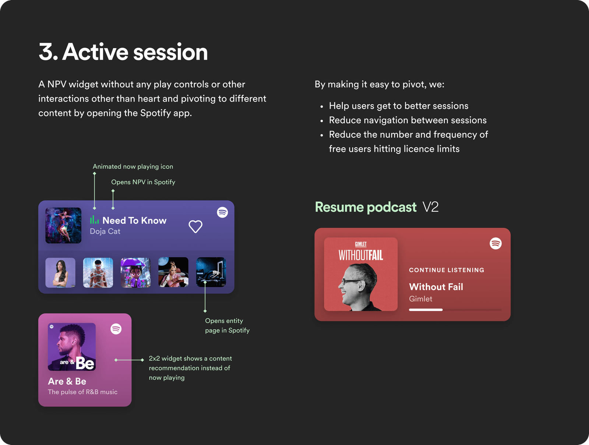
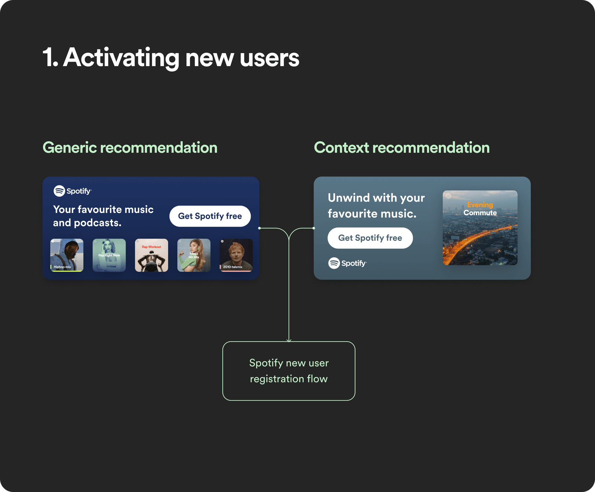
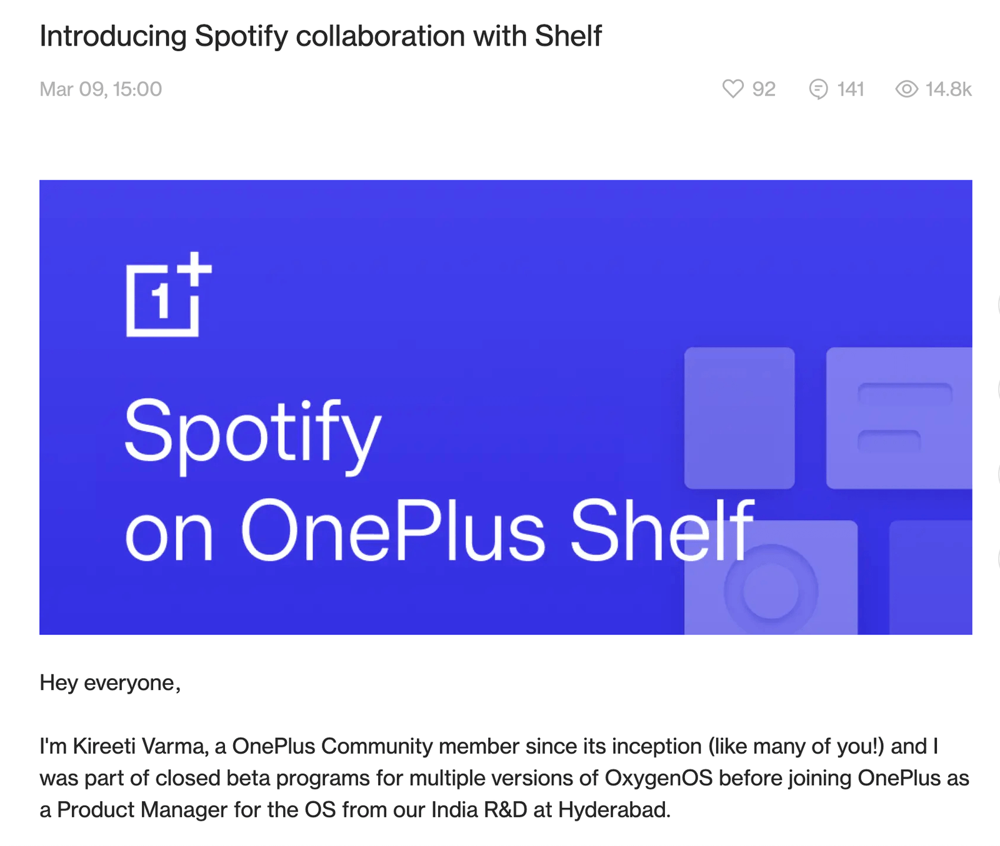
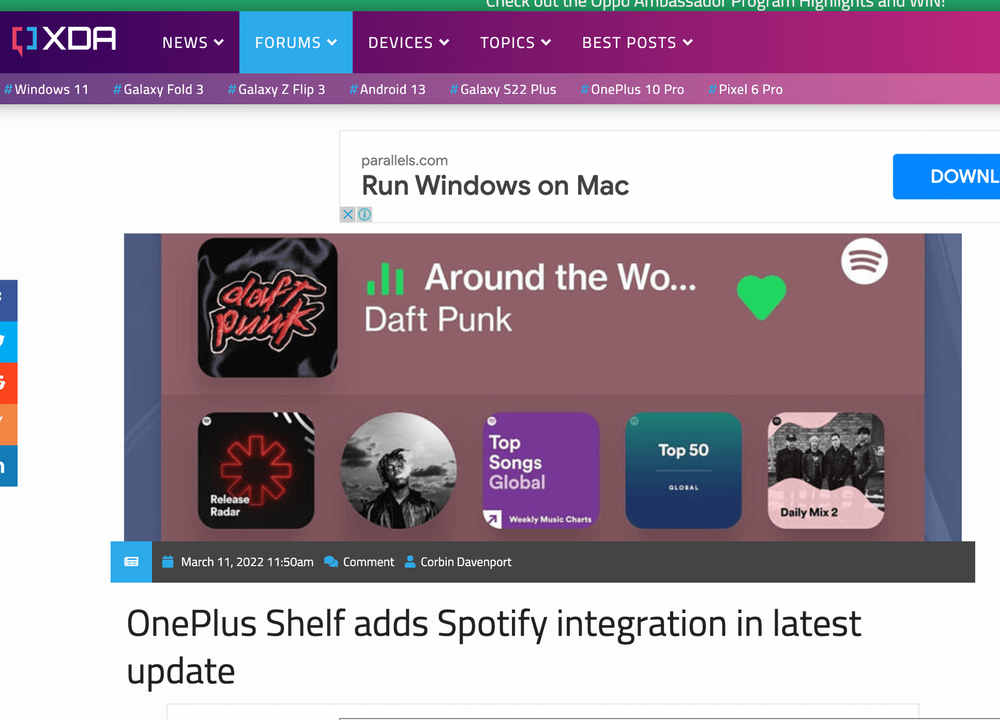
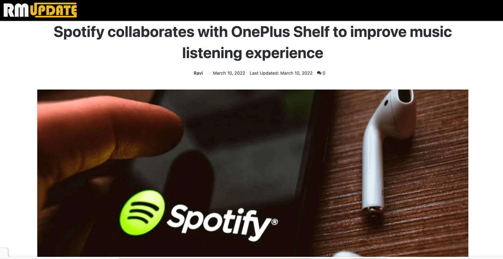
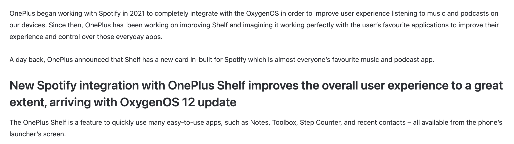
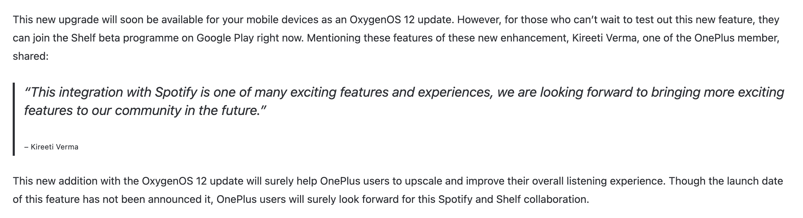

Card on Shelf to let users start or continue listening to recommended playlists or podcasts and like the tracks they are listening to.

### Duration

August 2021 - March 2022

### Role

Managed a team of design, development, testing, operations for brainstorming & conceptualising, analysing user feedback & conducting research, designing UX, UI, messaging, testing, release via play-store and launch the integration on community along with partner teams at Spotify.

## Background

Managed the integration of Spotify into the OnePlus Shelf feature, a customizable widget place on the phone. This project, spanning from August 2021 to March 2022, focused on improving user access to music and podcasts.

The objective was to encourage users to start or continue sessions with minimal friction, onboard new users with a clear value proposition, and allow them to continue listening to other playlists or like current playing tracks. The feature was announced on the OnePlus forum for community testing and feedback, with plans for iterative releases to all OnePlus users globally.

Spotify aimed to encourage users to start or continue sessions at minimal friction and onboard new users with a clear value proposition. Spotify also wanted users to pivot to other playlists or like the current tracks on this card.

We created a card on Shelf to access recommended content and let them quickly switch playlists by opening the Shelf page over any app.

## How it works?

All OnePlus users globally will be able to see Spotify card on Shelf in a 2x2 or 4x2 size which can be customised by their choice.

For a first user, who may not have Spotify installed, we would show the card with generic recommended content that allows them to download the app via playstore.

Existing users will be able to see the recommendations helping them to start picking from recommendations. Upon playing they have an option to like or choose another playlist or podcast.

## Press Coverage

We iterated the product with initial feedback from our closed & open beta testing groups to improve the experience and fix initial bugs on the page. The early feedback allowed us to anticipate the known issues while our team has started working on the improvements even before it is released to mass production.

### Release

We announced the integration on OnePlus Forum, for community testing and feedback. Over iterations, the app was released to more users to all OnePlus users based on further iterations.

[Read OS12 Forum Post here.](https://community.oneplus.com/thread?id=1551683)
