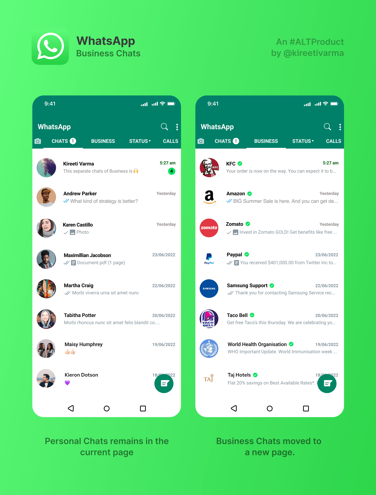
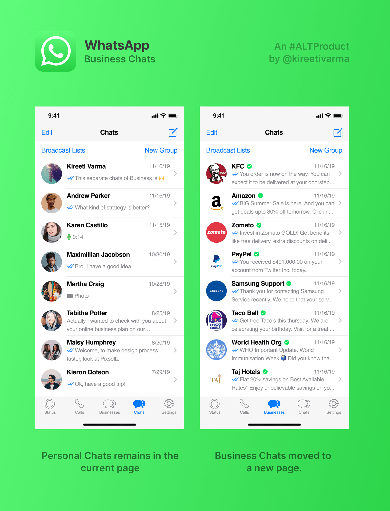

With the introduction of Business accounts on WhatsApp, the chat list has become cluttered with likely spam or unsigned messages.

This is a mock of how WhatsApp could separate business chats to a new section.

While this may reduce the CTR for businesses, it is still a considerable change, since most signed-up services are also moved, which retains users discover to new business messages as well.

*WhatsApp Android mockup*

*WhatsApp iOS mockup*
